# Homepage Modules

一个可扩展的 **Obsidian 个人主页插件** —— 用一个 `homepage` 代码块，渲染日记、待办、
番茄、自律、健身、精听听写、词根词缀、天气、会议 DDL、每日安排、日历、统计、倒计时等 **25 个交互模块**；再用「主页」把它们拼成一张
开箱即用的个人仪表盘。一个插件容纳多个模块，新增模块互不干扰，零主题依赖。

<div align="center">
  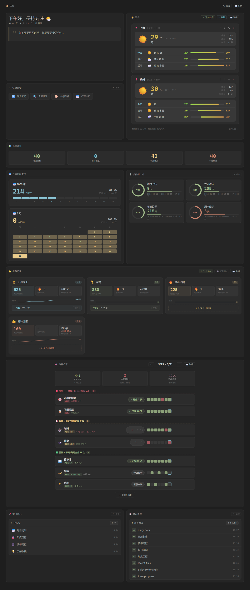<br>
  <sub><b>一张主页装下所有模块</b> · 卡片式布局 · 可自由增删 / 调宽 / 跨行 / 切列数</sub>
</div>

---

## 📖 目录

- [🌗 主题自适应](#theme)
- [🎨 核心功能模块](#modules)
- [🧩 主页配套小组件](#widgets)
- [🔌 插件级功能](#plugin-features)（含 🖥 工作台全屏视图）
- [💰 付费说明](#pricing)
- [🛡 隐私政策](#privacy)
- [📦 安装](#install)（BRAT / 手动本地安装）
- [✨ 快速开始](#quick-start)
- [🚀 使用](#usage)
- [🔒 多设备同步保护](#sync)
- [📱 平台](#platform)

---

<a id="theme"></a>

## 🌗 主题自适应（深 ↔ 浅一键切换，零配置）

所有模块颜色走 Nord 语义色板，跟随 Obsidian 主题自动适配，深色浅色都好看。

<div align="center">
  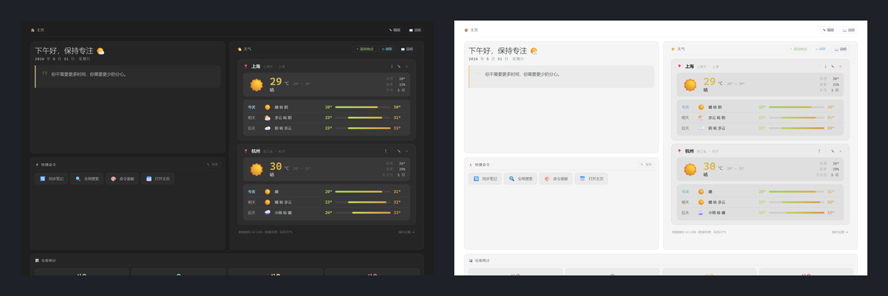
</div>

---

<a id="modules"></a>

## 🎨 核心功能模块

> 每个模块都是独立的 `homepage` 代码块，单独嵌进任意笔记也能用；下面是真实渲染效果。

<table>
<tr>
<td width="50%" valign="top">
  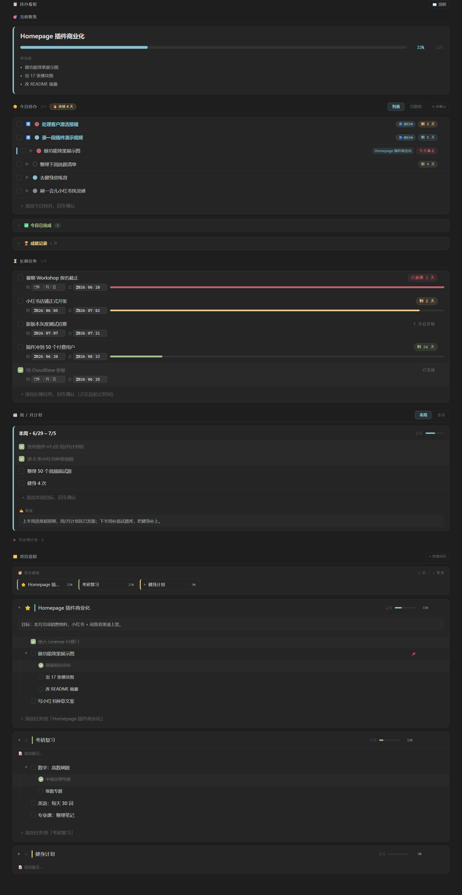<br>
  <b>✅ 待办看板</b><br>
  <sub>当前聚焦 + 今日待办（列表 / 四象限两视图，<b>切到哪个下次默认哪个</b>，可设截止时间按紧迫度自动排序，可标 <b>▶ 进行中</b> 让正在做的浮到最上）。完成的事项收进 <b>✅ 今日已完成</b> + 跨日沉入 <b>🏆 成就记录</b> 按日期回看（成就墙）+ 🔥 连续打卡，攒成就感不再手删。另含长期任务（起止 + 倒计时）+ 周·月计划（目标 + 复盘 + 自动归档）+ 项目追踪三层，项目可「派单」到今日待办双向同步。</sub>
</td>
<td width="50%" valign="top">
  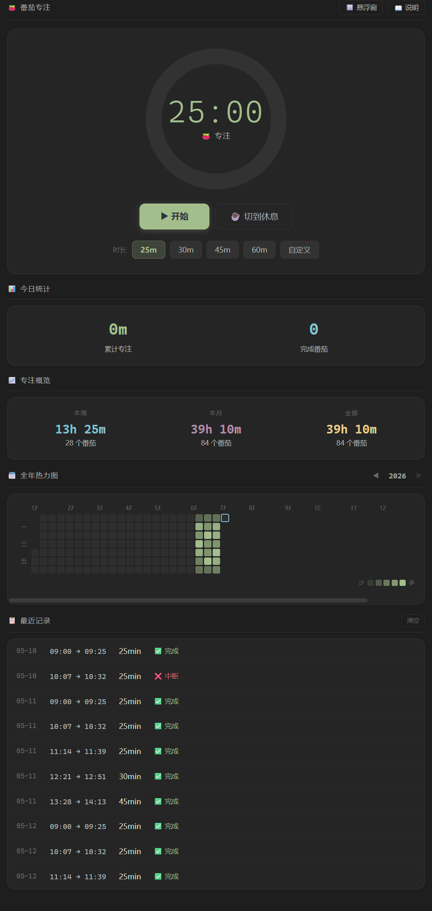<br>
  <b>🍅 番茄专注</b><br>
  <sub>时间戳法计时（关掉 Obsidian 也不丢进度）+ 桌面悬浮窗 + 全年热力图 + 历史记录可单条删除。</sub>
</td>
</tr>
<tr>
<td width="50%" valign="top">
  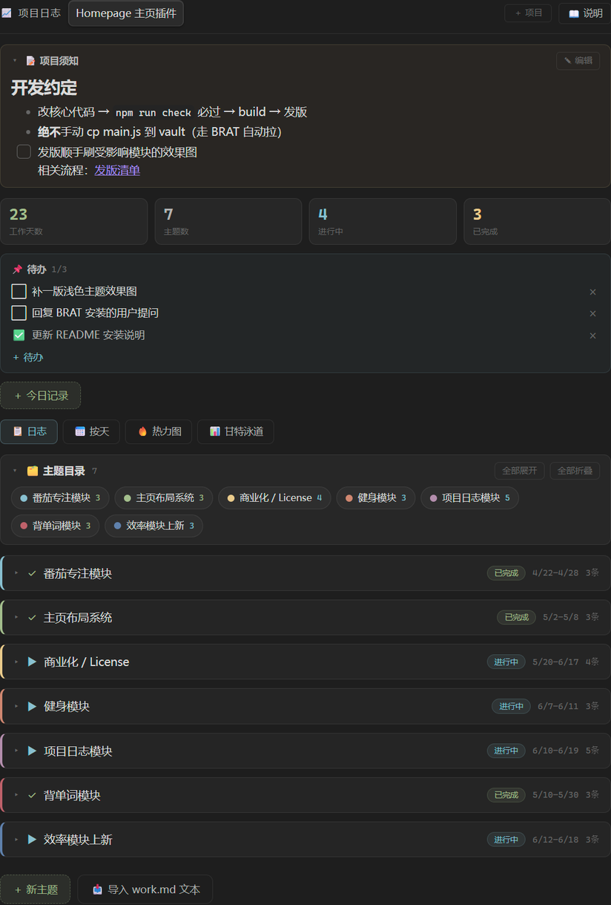<br>
  <b>📈 项目日志</b><br>
  <sub>项目→主题→每日条目三级管理 + 项目须知(Markdown) + <b>每项目独立「📄 开发流程」长文档</b>（独立 .md 记 SOP / 踩坑，真编辑器编辑 + 折叠预览）+ 待办（<b>可归属主题</b>，项目级总览 + 主题卡内汇总）；四视图（折叠日志 / 按天 / 热力图 / 甘特泳道），主题区间自动推导，重叠即并行。主题多时顶部有<b>🗂 主题目录</b>点击跳转 + 全部展开 / 折叠成大纲。</sub>
</td>
<td width="50%" valign="top">
  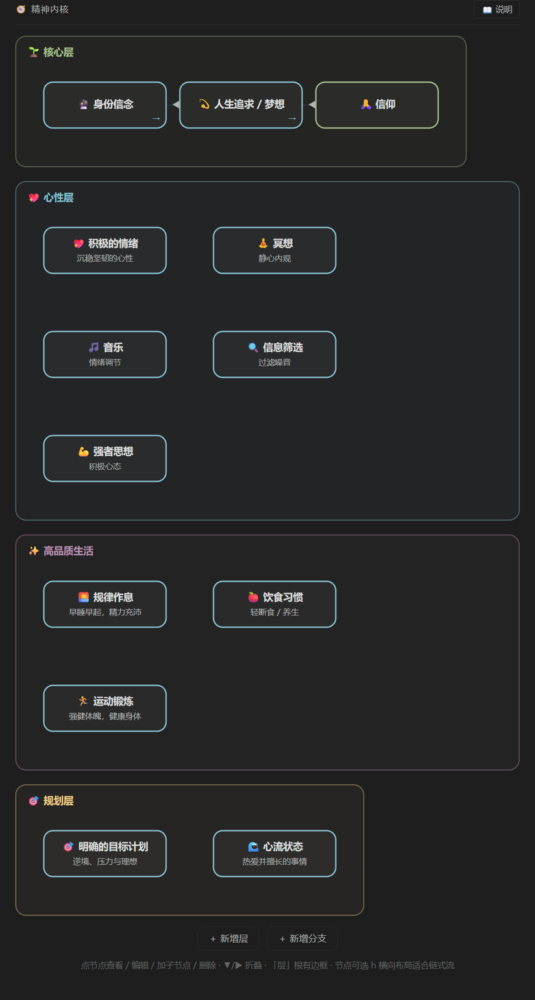<br>
  <b>🧭 精神内核</b><br>
  <sub>SVG 自动布局的价值观 / 原则树（替代手画 Canvas）。多根 + 「层」分组 + 横纵向布局；<b>节点可关联笔记</b>（从全库搜索选，不用手打路径），右下角 🔗 <b>一键跳转</b>。</sub>
</td>
</tr>
<tr>
<td width="50%" valign="top">
  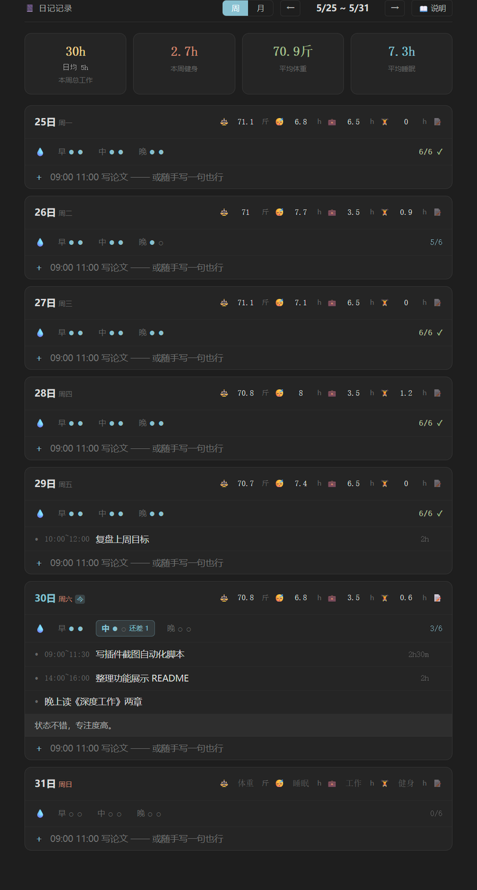<br>
  <b>📔 日记记录</b><br>
  <sub>每日体重 / 睡眠 / 工作 / 健身 4 个数字 + 💧 喝水打卡（早中晚各 2 杯）+ 时间段日志 + 周 / 月视图与汇总。</sub>
</td>
<td width="50%" valign="top">
  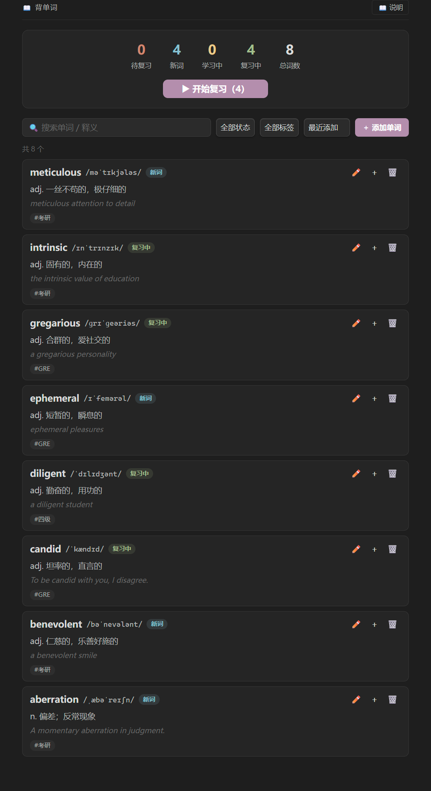<br>
  <b>📖 背单词</b><br>
  <sub>FSRS-6 间隔重复（Anki 同款调度）+ ECDICT 离线中文词库查词 + 词族关联 + 形近词自动辨析（archive/architect 这类易混词自动聚合）+ 复习弹窗。<b>词根关联</b>：给词标词根（percent/century 同属 cent「百」），同根词自动成组 + 显示词根含义（内置词根库建议、一键确认）。<b>单词列表为紧凑行 + 点击展开详情，可按首字母分组 + A-Z 索引快速查找</b>。</sub>
</td>
</tr>
<tr>
<td width="50%" valign="top">
  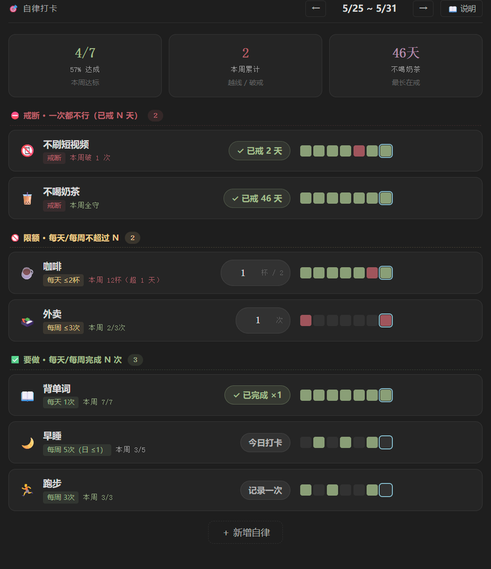<br>
  <b>🎯 自律打卡</b><br>
  <sub>要做 / 限额 / 戒断 三类约束，按类型分组 + 周视图 + 顶部三卡汇总 + 7 天迷你热力 + 自定义指标（跑步距离 / 配速 / 用时）。</sub>
</td>
<td width="50%" valign="top">
  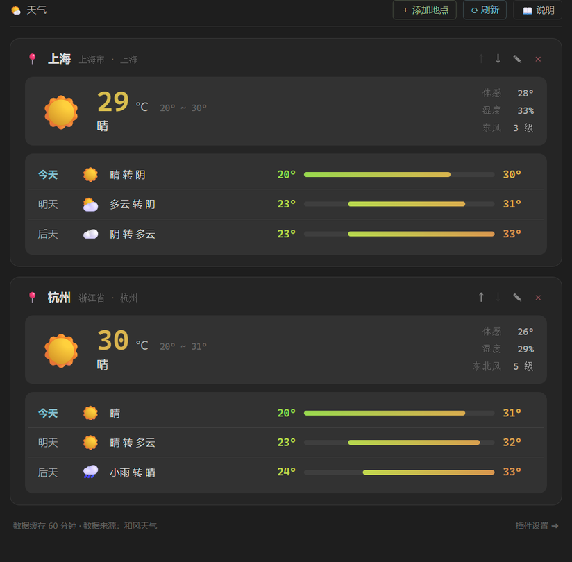<br>
  <b>⛅ 天气</b><br>
  <sub>多地点实况 + 未来 3 天预报（温度区间渐变条），数据源和风天气；支持区县搜索与镇 / 街道手动经纬度。</sub>
</td>
</tr>
<tr>
<td width="50%" valign="top">
  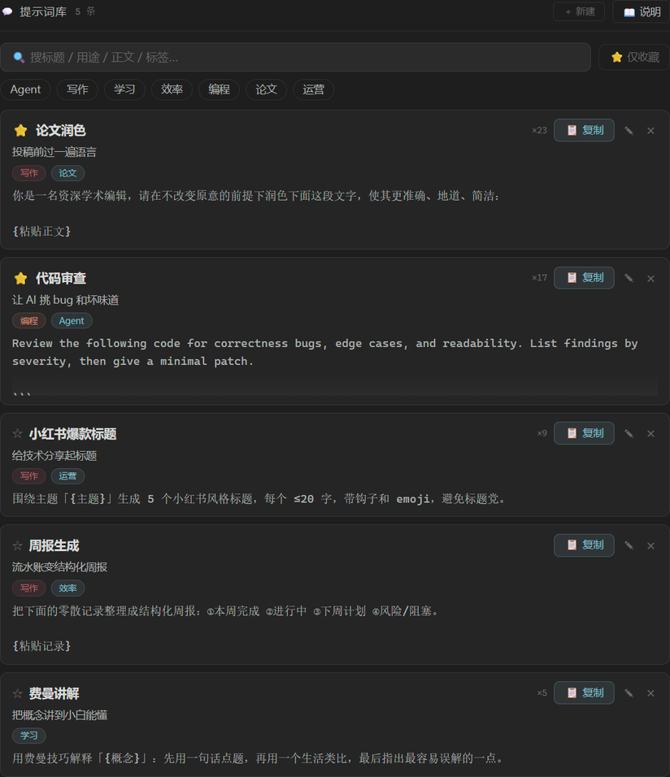<br>
  <b>💬 提示词库</b><br>
  <sub>常用 AI 提示词分标签管理：搜索 / 标签筛选 / 收藏置顶，一键复制原文直接喂给 ChatGPT / Claude / Agent。</sub>
</td>
<td width="50%" valign="top">
  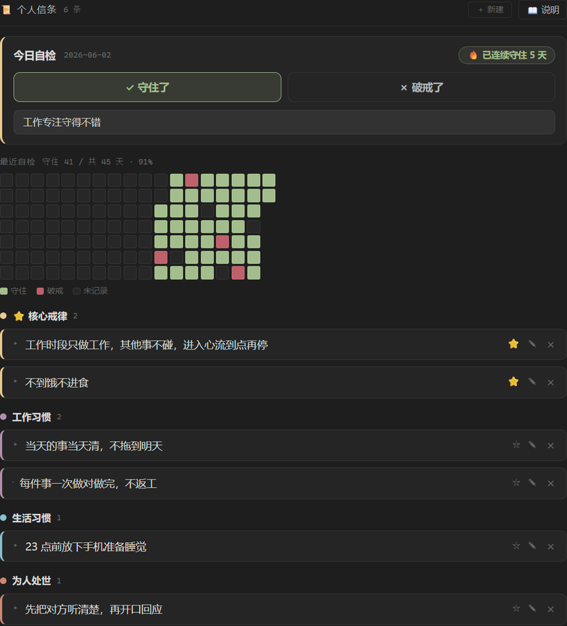<br>
  <b>📜 个人信条</b><br>
  <sub>把对自己的约束 / 原则一条条记下：分类管理 + 可展开「为什么 / 怎么做 / 触发场景」+ 核心戒律置顶；每天一次「守住 / 破戒」自检，攒连续坚持天数 + 回顾热力。</sub>
</td>
</tr>
<tr>
<td width="50%" valign="top">
  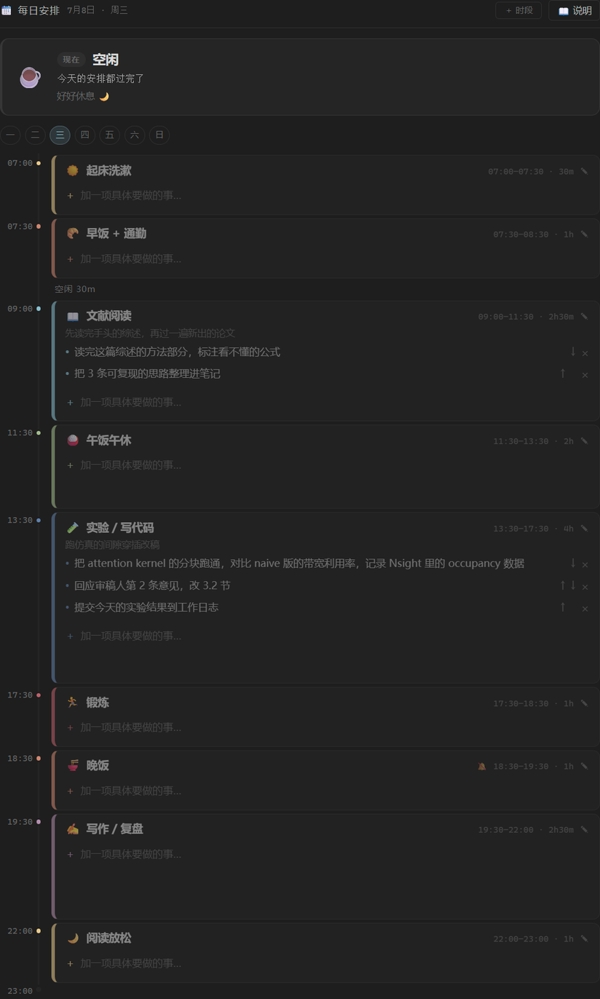<br>
  <b>📆 每日安排</b><br>
  <sub>一天的固定作息骨架：时间段排成比例时间轴，当前块高亮 + 按进度填充；「现在」卡大字提醒该做什么 / 还剩多久 / 下一项预告；时段开始弹提醒，适用日支持工作日 / 周末两套作息。</sub>
</td>
<td width="50%" valign="top">
  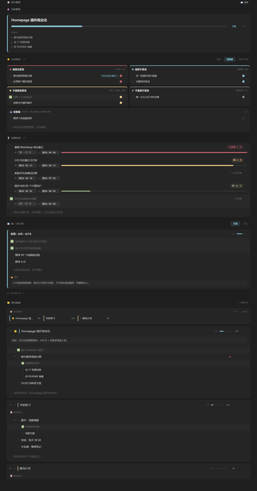<br>
  <b>🧮 待办 · 四象限</b><br>
  <sub>「今日待办」可切到艾森豪威尔四象限视图：按重要 / 紧急把待办分到 2×2 四格，未分类的待在「收集箱」；点色点或拖进格子即归类，格内按截止时间排，帮你决定先做什么。已完成项收进下方「今日已完成 / 成就记录」，格子保持清爽。</sub>
</td>
</tr>
</table>

<div align="center">
  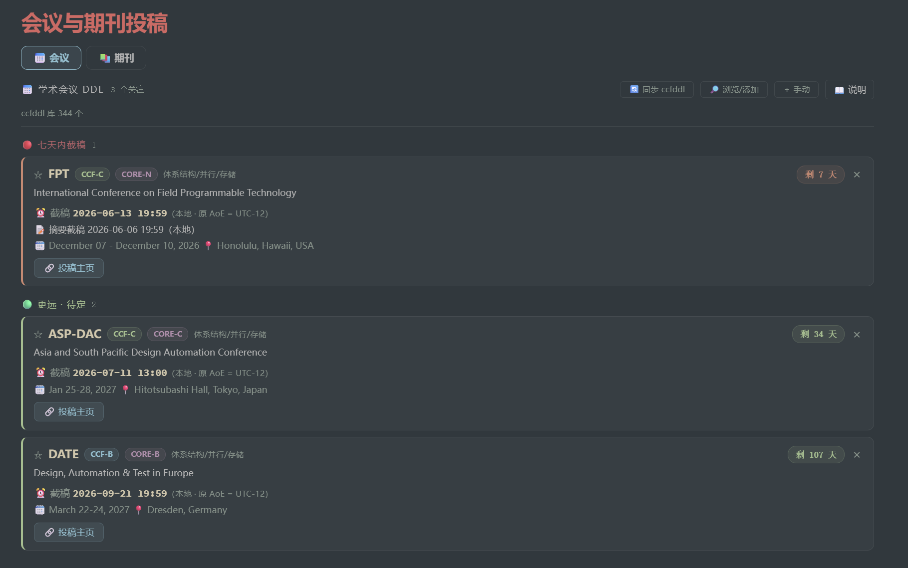<br>
  <b>📅 学术会议 / 期刊 DDL</b> · <sub>会议：ccfddl 同步 + 倒计时 + 时区换算 + 临近提醒；期刊：内置 13 个微电子 / EDA 刊的 CCF + 中科院分区 + IF + 投稿周期（🏛 官方 / 💬 网友双口径）+ 官网直达。</sub>
</div>

<div align="center">
  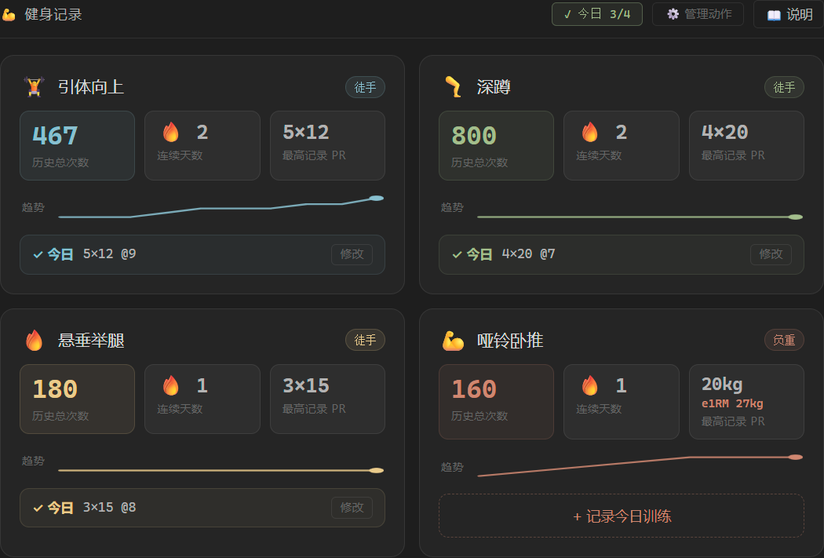<br>
  <b>💪 健身记录</b> · <sub>按动作记每日多组「重量×组数×次数」+ 选填 RPE；连续天数 🔥 / 历史总次数 / PR + 负重 e1RM 力量估算 + 每卡进步趋势小图。</sub>
</div>

<div align="center">
  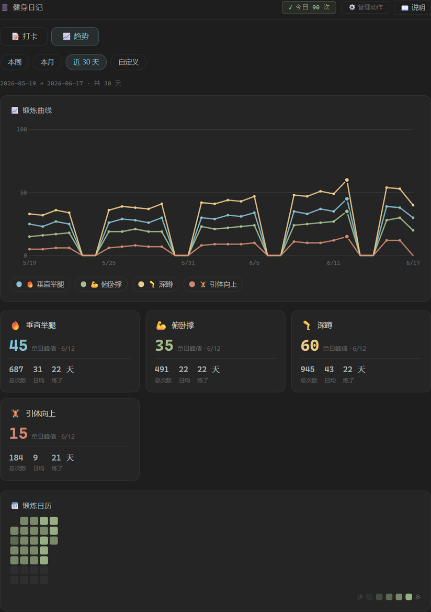<br>
  <b>📔 健身日记</b> · <sub>以「天」为中心的徒手训练打卡：每天填各动作总次数（垂直举腿 30 / 俯卧撑 20 / 深蹲 40…），选时间段看<b>多动作锻炼曲线</b> + 每个动作的<b>单日峰值</b>及达成日 + GitHub 风格坚持度热力图。与「健身记录」按动作撸铁互补。</sub>
</div>

<div align="center">
  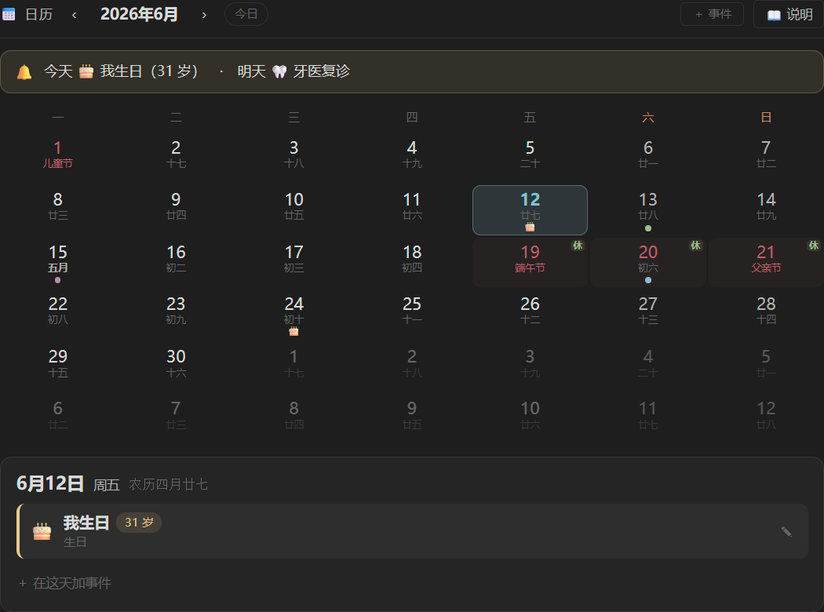<br>
  <b>📅 日历日程</b> · <sub>月历视图：一眼看全月放假 / 补班（内置法定节假日 + 调休「休 / 班」）+ 农历 + 节日（春节 / 中秋 / 母亲节 / 父亲节…）+ 家人生日（<b>支持农历，每年自动换算公历</b>）/ 纪念日 / 日程；可停右侧栏随时看，今天 / 明天的生日节日打开即提醒。</sub>
</div>

<div align="center">
  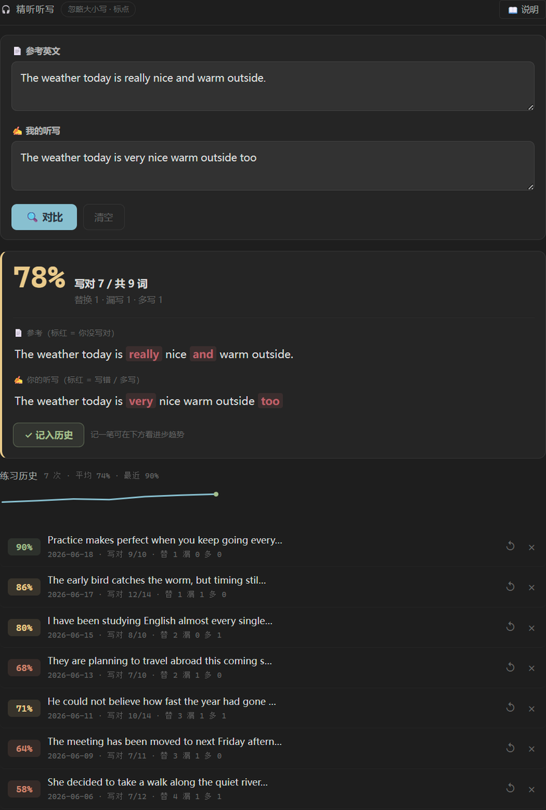<br>
  <b>🎧 精听听写</b> · <sub>英语精听练习：把你听写的句子和参考英文逐词比对，自动算出<b>单词准确率</b>，不一致的词<b>双行标红</b>方便核对（替换 / 漏写 / 多写都分得清，漏写多写不连累后面的词）。默认忽略大小写 / 标点；记入历史可看准确率进步趋势；一键「📋 复制给 AI」把原文 + 听写 + 对比结果复制下来，粘贴发给 AI 批改纠正。</sub>
</div>

<div align="center">
  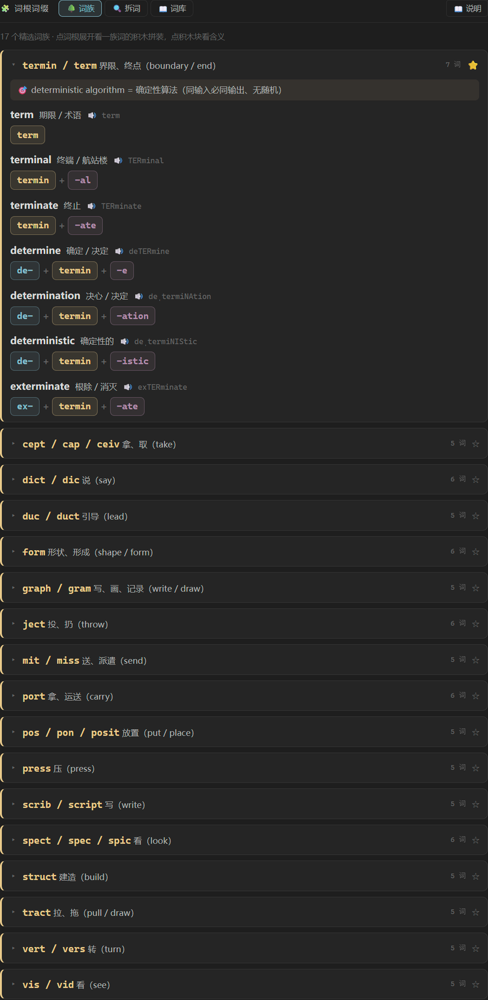<br>
  <b>🧩 词根词缀</b> · <sub>以构词单元背单词，和「背单词」互补：记住 <code>de- / termin / -ation</code> 一套拼装规则，就能拆 / 拼一整族词。<b>词族</b>视图把一族词拆成<b>彩色积木</b>（前缀蓝 / 词根金 / 后缀紫，点块看含义）+ 中文释义 + 🔊 重音迁移提示 + 锚定记忆例；<b>拆词</b>输入任意词自动拆成 前缀｜词根｜后缀；<b>词库</b>是前缀 / 词根 / 后缀三库速查（含义 / 拉丁·希腊来源 / 词例 / 后缀词性），带搜索。</sub>
</div>

---

<a id="widgets"></a>

## 🧩 主页配套小组件

<table>
<tr>
<td width="50%" valign="top">
  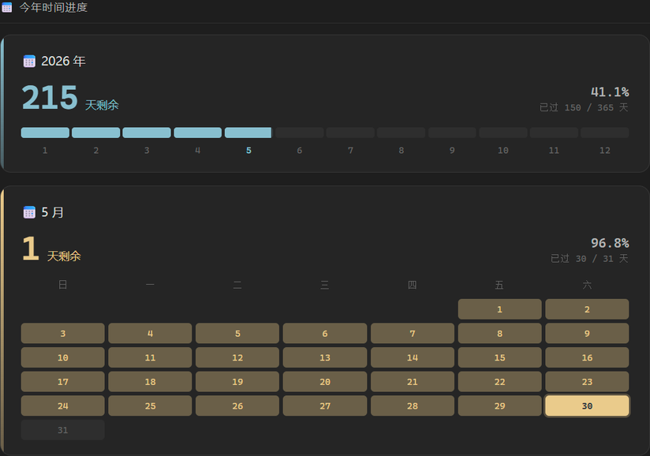<br>
  <b>📅 时间进度</b><br>
  <sub>年 / 月双卡：12 月份网格 + 日历 + 进度条 +「N 天剩余」，年蓝月金冷暖对比。</sub>
</td>
<td width="50%" valign="top">
  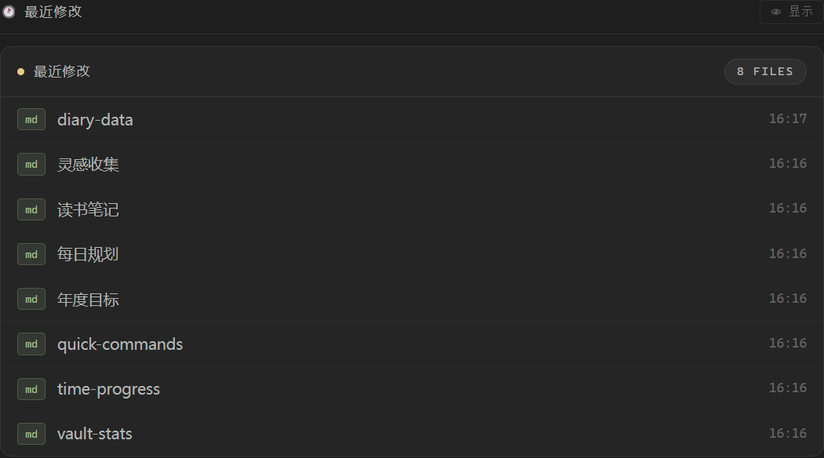<br>
  <b>📂 最近修改</b><br>
  <sub>按修改时间排前 N（默认 8）+ 扩展名 tag + 一键隐私模式（●●●●）。</sub>
</td>
</tr>
<tr>
<td width="50%" valign="top">
  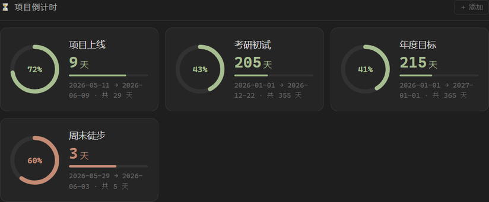<br>
  <b>⏳ 项目倒计时</b><br>
  <sub>卡片网格 + SVG 进度环 + 加 / 删 / 二次确认，临近变橙、到期变红。</sub>
</td>
<td width="50%" valign="top">
  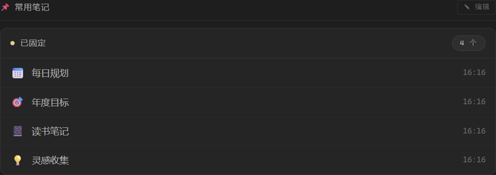<br>
  <b>📌 常用笔记</b><br>
  <sub>固定笔记列表，list / grid 双视图；添加走模糊搜索选择器，无需手打路径。</sub>
</td>
</tr>
<tr>
<td width="50%" valign="top">
  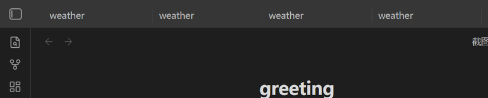<br>
  <b>👋 问候 + 名言</b><br>
  <sub>时段问候（早 / 午 / 下午 / 晚 / 夜）+ 日期 + 每日轮播名言。</sub>
</td>
<td width="50%" valign="top">
  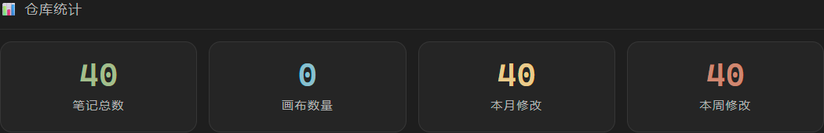<br>
  <b>📊 仓库统计</b><br>
  <sub>笔记总数 / 画布数 / 本月修改 / 本周修改，4 张大数字卡。</sub>
</td>
</tr>
</table>

<div align="center">
  <br>
  <b>⚡ 快捷命令</b> · <sub>一键执行任意 Obsidian 命令的按钮行（如笔记同步、全局搜索、命令面板）。</sub>
</div>

---

<a id="plugin-features"></a>

## 🔌 插件级功能（不写代码块，设置里开关）

### 🖥 工作台（把整套插件当一个应用用）

不想为每个工具单独开页面？桌面端点**右下角状态栏「🖥 工作台」**（就在「🏠 主页」旁边）/ 命令「打开工作台」一键进入（移动端走左侧 ribbon）：左侧栏分组列出全部 17 个重型工具（每日 / 学习 / 自我 / 其它），点击在主区一次显示**一个完整工具**、工具间一键跳转——像 VS Code / Notion 那样的「侧栏 + 单一主内容区」。侧栏可一键折叠成图标栏腾出空间，自动记住你上次打开的工具。工作台里 **`Alt + ↑/↓` 直接切工具**（像 IDE 切标签）；当前工具标题条右侧可「↗ 新标签打开」把它单独拉到新标签、与笔记并排看。与现有「主页」仪表盘**并存**，按习惯任选。

侧栏底部还有 **「⚙️ 设置」入口**：插件所有设置直接在工作台里调，**左侧分组导航点一下只看该组**，不用再去又长又混的 Obsidian 设置面板里滚到底找；每个工具标题条的「⚙️」还能一键直达**该工具自己的设置**。

<div align="center">
  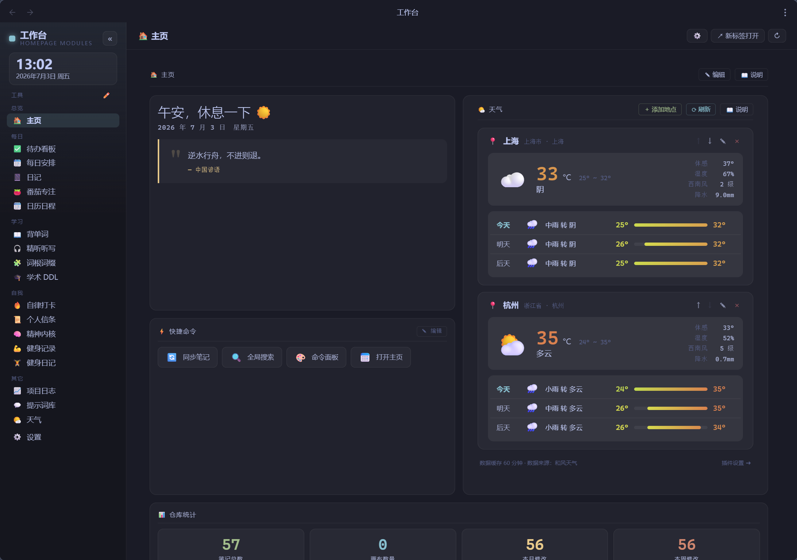<br>
  <sub><b>展开</b>：左侧分组工具导航 + 实时时钟，主区铺开完整工具（图为待办看板）</sub>
</div>

<div align="center">
  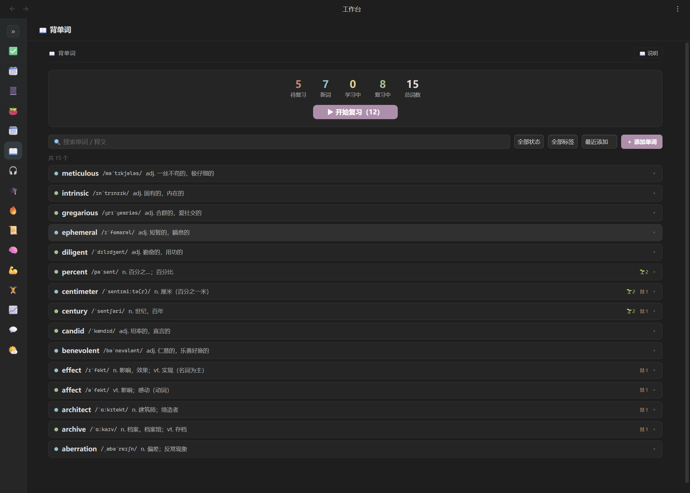<br>
  <sub><b>折叠</b>：侧栏收成图标栏（悬停显名），主区更宽（图为背单词）</sub>
</div>

<div align="center">
  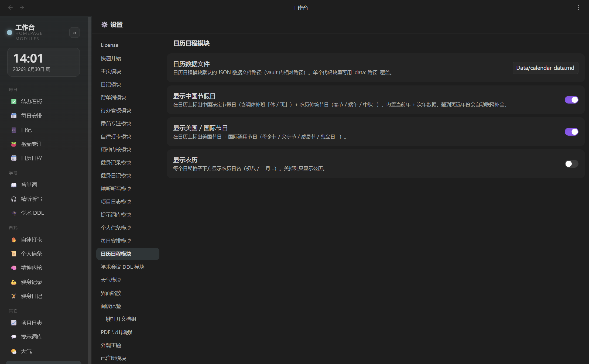<br>
  <sub><b>设置页</b>：左侧分组导航，点一下只显示该组，不用再翻 Obsidian 设置面板</sub>
</div>

- **Ctrl + 滚轮缩放整个 UI** —— 补回 Obsidian 老版本的滚轮缩放（`Ctrl + 0` 复位）。仅桌面端。
- **番茄状态栏指示器** —— 底部状态栏一眼可见番茄进度，点击 = 开始 / 暂停 / 继续。仅桌面端。
- **阅读体验：图片对齐 + 页面行宽 + 去嵌入竖条** —— 可选图片对齐（左 / 中 / 右）+ 自定义行宽 + 去掉 `![[...]]` 嵌入笔记的左侧竖条（阅读视图 + 导出 PDF 同时生效）。默认零影响。
- **一键打开文档组** —— 右下角状态栏「📂 工具组」按钮点一下打开你预设的一组常用文档（各成标签页），快速恢复阅读布局；已打开的不重复开。设置里用文件选择器配置 + 排序。仅桌面端。
- **PDF 导出增强** —— 导出 PDF 时让**表格不跨页**（纵向：整张尽量落一页，放不下的大表保证「行不腰斩 + 表头每页重复」）+ **宽表适应页宽**（横向：太宽的表不裁右侧列、单元格内容自动换行，可再选字体缩放），可选 callout / 代码块 / 图片也不跨页；命令「插入 PDF 目录页」给当前笔记插入一段**「隐身目录」**——平时在编辑/阅读视图隐藏、不碍眼，**导出 PDF 时自动显示**成一页目录（供读者看全文章节结构，`[[#标题]]` + 层级缩进），一次插入、以后每次导出都自动带，「移除 PDF 目录页」彻底撤掉。设置里配目录标题 / 收录层级 / 是否单独成页。注：受 Obsidian 原生导出限制，PDF 里目录项不可点击跳转、也不生成 PDF 书签（Obsidian 老限制）。
- **外观主题：全局换肤** —— 「设置 → 外观主题」一键开启，用内置的一套自定义外观给整个 Obsidian 换肤、关闭切回原主题。冷色沉静风（呼应插件的 NORD 配色），保留描边卡片质感，并关掉了重度毛玻璃换纯色卡片——**更清爽、滚动顺滑**。**强调色可选配色**（霜青蓝 / 薄荷青…，点色块即时切换，背景不变）。走 Obsidian 原生主题机制，不和你当前主题冲突。基于开源主题 Border（© 2022 Akifyss · MIT）定制。

<p align="center">
  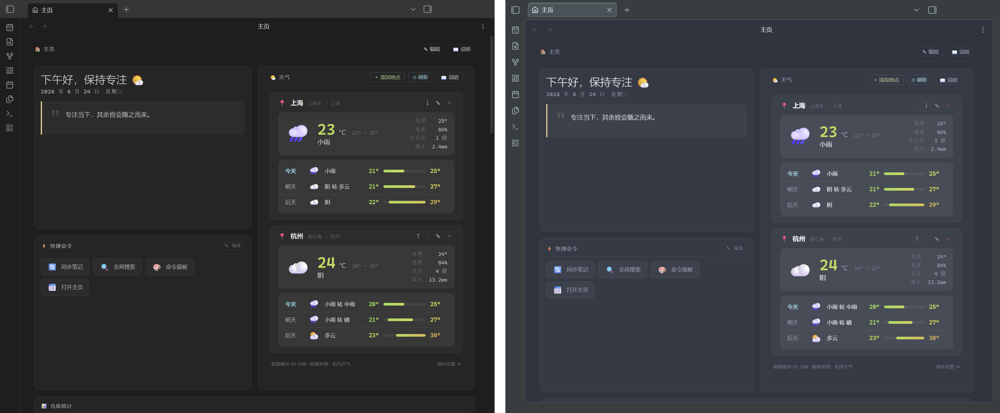<br>
  <sub>「外观主题」前后对比　·　左：Obsidian 默认　→　右：开启外观主题（基于 Border 定制的 NORD 冷色风，已关毛玻璃优化）</sub>
</p>

---

<a id="pricing"></a>

## 💰 付费说明（v1.0.0 起商业化）

**Payment Required — 7 天免费试用 + 一次买断终身使用**

| 项目 | 内容 |
|---|---|
| 💸 价格 | **¥39 一次买断**（不是订阅，永久有效，跨所有未来版本） |
| ⏳ 试用 | 装上后自动进入 **7 天免费试用**，全部功能解锁（首次启动联网注册一次试用，之后离线照常用） |
| 🔑 激活方式 | 收到 License Key 后，在「设置 → Homepage Modules → License」粘贴 Key 即可激活 |
| 💻 设备数 | 一个 Key **最多绑定 3 台设备**。换电脑前在旧设备点「解绑本设备」即可腾出名额 |
| 🌐 联网要求 | **试用首次启动 + 激活时各联网校验一次**（只传匿名设备标识 / Key，**不传任何笔记内容**）；之后**离线运行**，断网也有 3 天宽限 |
| 🔄 版本更新 | License 跨版本永久有效，未来插件更新无需重新付费 |

### 购买方式

**小红书联系作者**（搜「雪天鱼」/ 小红书号 `6289484655`）：


扫码或在小红书搜索「雪天鱼」私信，备注「homepage-modules license + 你的邮箱」。
作者收款后 24h 内将 License Key 发邮件给你。

---

<a id="privacy"></a>

## 🛡 隐私政策

本插件遵循 Obsidian「offline-first」原则，业务数据全程留在本地：

- ✅ **不上传任何笔记内容**：日记 / 待办 / 番茄 / 词汇等所有业务数据始终停留在你的 vault 内，绝不外传
- ✅ **不收集使用统计、不监控行为**
- ✅ **试用首次启动 + 激活时联网一次**：仅向授权服务器上传一个**匿名设备标识**（随机串，存本地、不随 vault 同步、不含任何个人信息）+ 激活时的 License Key，用于注册试用首次时间 / 校验授权和设备数上限（最多 3 台）；之后离线运行，**不再连接服务器**（断网另有 3 天宽限自动重试）
- ✅ **未激活时数据安全**：试用结束 / 未激活时插件不修改你 vault 里的任何 `Data/*.md` 文件，激活后所有数据原样回来

另一处可选网络请求是 **天气模块**调用和风天气 API 查询你配置的城市，这是模块功能必需，跟 License 验证无关。

---

<a id="install"></a>

## 📦 安装

两种方式任选其一，**推荐 BRAT（能跟随发布自动更新）**；不想装 BRAT、或 BRAT 撞 GitHub 限额、内网离线时，用「方式二 手动本地安装」。

### 方式一：BRAT（推荐，自动更新）

本插件未上架社区市场，用 [BRAT](https://github.com/TfTHacker/obsidian42-brat) 安装与自动更新：

1. 安装并启用社区插件 **BRAT**
2. BRAT 设置 → **Add Beta Plugin** → 填入本仓库：
   ```
   XueTianyu24/obsidian-homepage-modules
   ```
3. 启用 **Homepage Modules**

之后每次发布新版本，BRAT 会在所有设备上自动更新。

### 方式二：手动本地安装（无需 BRAT，适合离线 / 限额）

1. 打开本仓库的 [**Releases**](https://github.com/XueTianyu24/obsidian-homepage-modules/releases/latest)，下载最新版附带的三个文件：`main.js`、`manifest.json`、`styles.css`
2. 在你的 vault 里进入（没有就新建）插件目录：
   ```
   <你的库>/.obsidian/plugins/homepage-modules/
   ```
3. 把上面三个文件放进该目录
4. 回到 Obsidian → **设置 → 第三方插件**，点刷新，启用 **Homepage Modules**（若列表里没看到，完全退出再重开 Obsidian）

> ⚠️ 手动安装**不会自动更新** —— 每次发布新版都要回 Releases 重新下载这三个文件覆盖旧的。想要自动更新请用上面的 BRAT 方式。
>
> 💡 `.obsidian` 是隐藏目录（需在系统里开启「显示隐藏文件」）；插件目录名**必须**是 `homepage-modules`，否则 Obsidian 不识别。

#### 🔑 BRAT 提示 GitHub API rate limit 怎么办

BRAT 检查更新要调 GitHub 接口，**不登录时匿名限额只有 60 次/小时**（按 IP 算）。装的 beta 插件一多、或频繁点检查更新，就容易撞到 `GitHub API rate limit` 报错。配一个 GitHub **Personal Access Token（PAT）** 认证后，限额升到 **5000 次/小时**，基本一劳永逸：

1. 打开 GitHub → 右上头像 → **Settings → Developer settings → Personal access tokens**，生成一个 token（**Tokens (classic)** 或 **Fine-grained tokens** 都行）
2. **装公开插件无需任何权限**：classic token **不用勾选任何 scope**；fine-grained 选 **Public Repositories（read-only）** 即可。token 只用于认证身份、提高限额，不需要写权限
3. 建议设个**过期时间**（别选 No Expiration）；生成后**立刻复制**（离开页面就不再显示）
4. 回到 Obsidian → **设置 → BRAT → 填进「Personal Access Token」字段**，填完会自动校验有效性

> 💡 生成 token 时 GitHub 可能要求用 **密码 / 两步验证 / Passkey（通行密钥——指纹、面容或设备 PIN）** 再确认一次身份，这是它的安全步骤，按提示验证即可（不想用 Passkey 可点验证框里的「用其他方式验证」切回密码）。
>
> ⚠️ token 等同密码：**存进密码管理器、不要外泄、不要提交进任何仓库**。过期后限额会掉回 60，重新生成换上即可。

<a id="quick-start"></a>

## ✨ 快速开始（推荐）

装好后，命令面板（Ctrl / Cmd + P）搜「**创建效率工具页面**」，或在 **设置 → Homepage Modules → 快速开始** 点「创建页面」：插件会在你 vault 的「效率工具」目录下，为日记 / 番茄 / 待办 / 背单词 / 自律 / 精神内核 / 天气 / 健身 / 健身日记 / 精听听写 / 词根词缀 / 项目日志 / 提示词库 / 个人信条 / 学术 DDL / 每日安排 / 日历各建一个**开箱即用**的页面 + 一张总览导航页。

- **可选、不自动执行**：只有你主动点才会创建，绝不擅自动你的 vault
- **不覆盖**：已存在的同名文件自动跳过
- 目录名可在设置里改。主页（仪表盘）继续放轻量小部件，这些重型工具走各自独立页面更好用

<a id="usage"></a>

## 🚀 使用

在任意笔记里写一个代码块，语言写 `homepage`，第一行写模块 id：

````markdown
```homepage
diary
```
````

把多个模块拼成一张主页：桌面端点底部状态栏「🏠 主页」/ 移动端点左侧 ribbon /
命令「打开主页」，即可打开独立的主页标签页，铺满面板。首次打开可一键应用推荐布局；
编辑模式下 ↑↓ 调位置 / ▢▭ 切单列整行 / ⇕ 切跨行高度 / + 添加模块 / 切 1·2·3 列。

每个模块头部都有「📖 说明」按钮，点开即是该模块的完整用法。

### 模块 id 一览

| 模块 id | 名称 | 模块 id | 名称 |
|---|---|---|---|
| `home` | 主页（聚合） | `diary` | 日记记录 |
| `vocab` | 背单词 | `todo` | 待办看板 |
| `pomodoro` | 番茄专注 | `discipline` | 自律打卡 |
| `psyche` | 精神内核 | `weather` | 天气 |
| `gym` | 健身记录 | `project-log` | 项目日志 |
| `greeting` | 问候 + 名言 | `vault-stats` | 仓库统计 |
| `time-progress` | 时间进度 | `countdown` | 项目倒计时 |
| `pinned-notes` | 常用笔记 | `recent-files` | 最近修改 |
| `quick-commands` | 快捷命令 | `prompts` | 提示词库 |
| `principles` | 个人信条 | `deadlines` | 学术会议 / 期刊 DDL |
| `schedule` | 每日安排 | `calendar` | 日历日程 |
| `workout` | 健身日记 | `dictation` | 精听听写 |
| `morph` | 词根词缀 |  |  |

---

<a id="sync"></a>

## 🔒 多设备同步保护

数据存 vault 内 `.md` 文件，可见、可 git、卸载后仍在。多设备同步（remotely-save 等）
场景下接入了「新设备保护门」：数据文件不存在且本会话未确认时，模块不渲染可编辑界面，
显示保护提示 + 「重新检查 / 全新开始」，避免新设备造冲突文件覆盖真实数据。

<a id="platform"></a>

## 📱 平台

桌面端与移动端（iOS / Android）均可用。悬浮窗 / 状态栏 / 滚轮缩放等桌面专属功能
在移动端自动跳过、不影响其它模块加载。

---

作者：雪天鱼 · MIT License

> 注：文档中的截图为演示数据，安装后所有数据均来自你自己的 vault。
