# 万象

**包罗万象的 Obsidian 个人管理套件** —— 日记、待办、番茄专注、背单词、自律、健身、精听听写、
词根词缀、词组、账号密码、专注规划、出门清单、求职进度、资产记录、思维导图、画布、天气、会议 DDL、
每日安排、日历、统计、倒计时等 **32 个交互模块** + **11 个插件级功能**。
每个模块都是一个 `homepage` 代码块，可嵌进任意笔记；也可以在**全屏工作台**里当一个独立应用来用；
还能用「主页」把它们拼成一张开箱即用的个人仪表盘。一个插件容纳多个模块，互不干扰，零主题依赖。

> 📛 **v1.80.0 起本插件由「Homepage Modules」更名为「万象」**。只是展示名变了 —— 插件 id、
> `homepage` 代码块、发布仓库地址、已购买的 License Key 全部照旧，升级后无需任何操作。

<div align="center">
  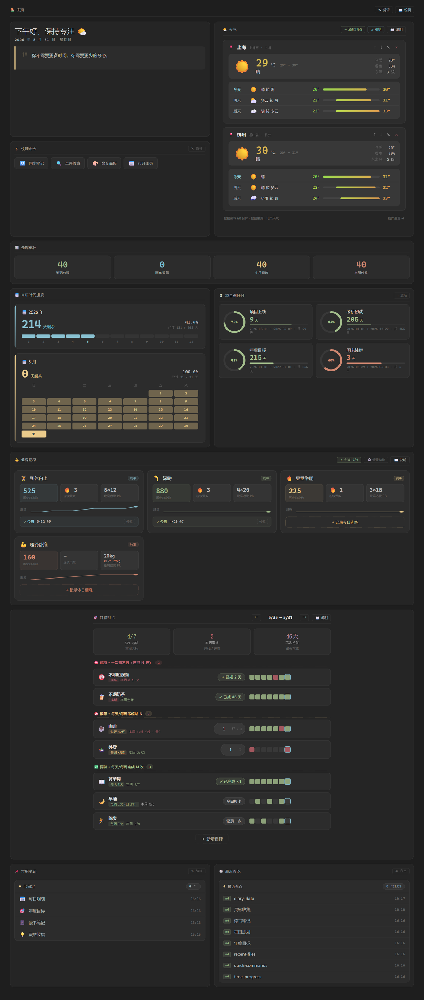<br>
  <sub><b>一张主页装下所有模块</b> · 卡片式布局 · 可自由增删 / 调宽 / 跨行 / 切列数</sub>
</div>

---

## 📖 目录

- [🌗 主题自适应](#theme)
- [🎨 核心功能模块](#modules)
- [🧩 主页配套小组件](#widgets)
- [🔌 插件级功能](#plugin-features)（含 ☁️ 多设备同步、🖥 工作台全屏视图）
- [💰 付费说明](#pricing)
- [🛡 隐私政策](#privacy)
- [📦 安装](#install)（BRAT / 手动本地安装）
- [✨ 快速开始](#quick-start)
- [🚀 使用](#usage)
- [🔒 多设备同步保护](#sync)
- [📱 平台](#platform)

---

<a id="theme"></a>

## 🌗 主题自适应（深 ↔ 浅一键切换，零配置）

所有模块颜色走 Nord 语义色板，跟随 Obsidian 主题自动适配，深色浅色都好看。

<div align="center">
  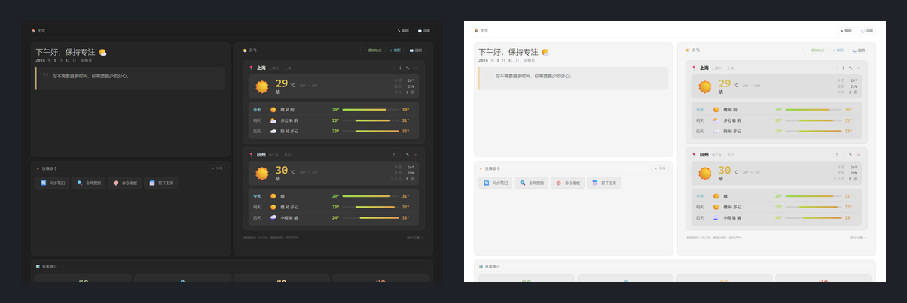
</div>

---

<a id="modules"></a>

## 🎨 核心功能模块

> 每个模块都是独立的 `homepage` 代码块，单独嵌进任意笔记也能用；下面是真实渲染效果。

<table>
<tr>
<td width="50%" valign="top">
  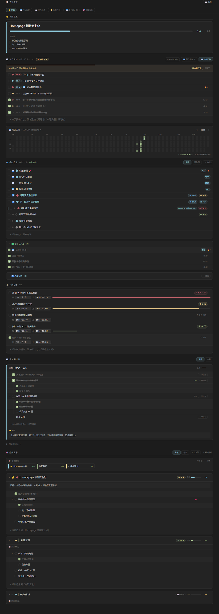<br>
  <b>✅ 待办看板</b><br>
  <sub><b>顶部区间导航</b>：一行吸顶 chips（聚焦 / 今日规划 / 待办汇总 / 长期任务 / 周·月计划 / 短期目标），点哪个跳哪个、滚多深都点得到、当前区自动高亮，不用再滚轮找区。<b>🗓️ 今日规划</b>：每天上班先手写「今天要做什么」的一张白纸（只手动写、不从汇总搬；勾完划线留原位，头部显示日期 + 进度 + 🔥 连续），<b>跨日自动开新的一天</b>、往日留库当历史；上次没做完的顶部一行 <b>↪ 顺延到今天</b>（复制一份，历史那天仍记着当天没做完）。每条还能设<b>优先级</b>（高 / 中 / 低色点）和<b>计划时刻</b>（<code>09:30</code> 徽章，<b>到点还没做完自动变红</b>，一眼看出今天哪件拖了；有 5 个常用钟点可一键选，也可以在输入框直接写 <code>9:30 写周报</code> 一次写完）；默认按「<b>有时刻的按点排 → 其余按优先级 → 做完的沉底</b>」自动排序，也能一键切回手动自己用 <code>⤒▲▼</code> 排（v1.90.0）。<b>🔁 每日固定</b>（v1.92.0）：「每天练一篇英语听力」「周一三五跑步」这种每天都要做的事不用天天手写——建一条，<b>到期那天自动出现在今日规划里</b>（可带优先级和计划时刻），<b>勾选 = 完成 + 打卡</b>（算进 🔥 连续天数与热力图，一件事只算一遍）；今天不想做就 <code>×</code> 掉，<b>只删今天这次、明天照常出现</b>，也不会被顺延堆到第二天。<b>📅 每日记录</b>：全年热力图（色深＝当天完成件数），<b>点某天看那天的完整清单</b>——规划了啥、哪些没做完、从汇总完成了啥、打了哪些周期卡。<b>📥 待办汇总</b>：长期堆着的所有事，列表 / 四象限两视图（<b>切到哪个下次默认哪个</b>）+ 截止时间自动排序 + <b>▶ 进行中</b>，完成的收进 <b>✅ 今日已完成</b>。<b>🔁 周期任务</b>（每天 / 每周几 / 每月几号 / 每 N 天重复，到期自动出现、打勾次日重现；建的时候选<b>投放到「待办汇总」还是「今日规划」</b>，一条只投一处）。<b>📆 周·月计划</b>：本周 / 本月的目标 + 复盘，到期自动翻新页、旧的存历史；<b>目标还能往下拆一层子任务</b>（行上显示 <code>2/3</code> 进度、▼ 可收起；<b>子任务全勾目标自动算达成</b>，点目标勾选框 = 一键把子任务全勾 / 一并取消，卡头进度条永远和实际一致）。另含长期任务（起止 + 倒计时）。<b>🎯 短期目标</b>（v1.89.0，原「项目追踪」）：盯最近要达成的几个目标，目标 → 任务 → 子任务三层拆解 + 进度条，可「派单」到汇总双向同步；每个目标能设<b>执行时间</b>（自动显示 <code>剩 N 天</code>／<code>已逾期 N 天</code>／<code>N 天后开始</code>，快到期变橙、逾期变红）和<b>优先级</b>（高 / 中 / 低），默认按「优先级 → 截止时间」自动排、做完的沉底，也能一键切回手动自己排。还有<b>看板视图</b>：未开始 / 进行中 / 已完成三列，<b>状态跟着任务完成率自己算</b>（一条没勾 = 未开始、勾了一部分 = 进行中、全勾完 = 已完成），不用手动维护；任务还没开始勾但你已经在推进了，把卡片拖到「进行中」就行，随时能一键恢复自动。</sub>
</td>
<td width="50%" valign="top">
  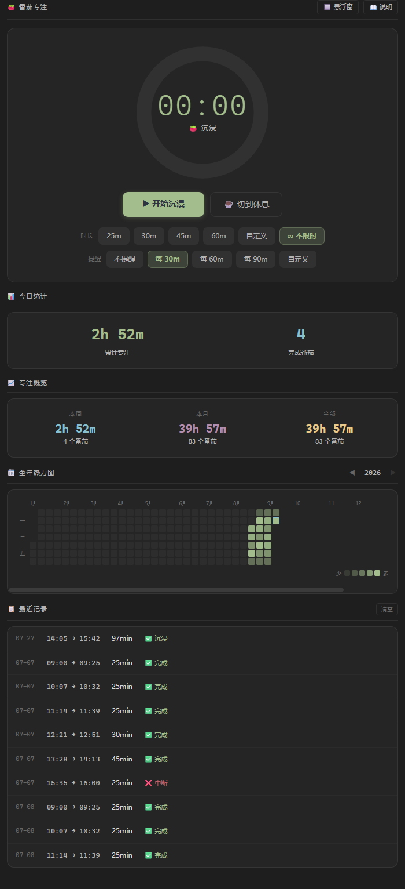<br>
  <b>🍅 番茄专注</b><br>
  <sub>时间戳法计时（关掉 Obsidian 也不丢进度）+ <b>沉浸模式（正计时）</b>：点「∞ 不限时」从 0 往上走、不自动结束，按你设的间隔（每 30m / 60m / 90m…）轻声提醒一次、不打断，干完点「✓ 结束」记一条（桌面悬浮窗缩成迷你小条时，沉浸中也常显这个「✓」，不用还原窗口）。另有桌面悬浮窗 + 全年热力图 + 历史记录可单条删除。开始 / 暂停只认明确的按钮 —— 圆环和迷你窗的时间数字都不响应点击，<b>不会一碰就把计时悄悄停了</b>；真暂停时图标换成金色暂停符、数字转灰，一眼看得出。</sub>
</td>
</tr>
<tr>
<td width="50%" valign="top">
  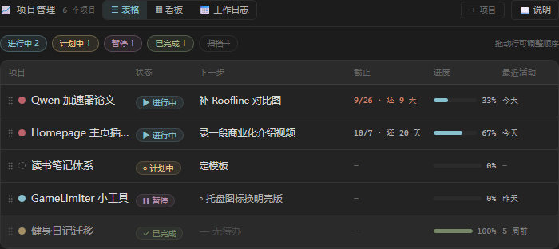<br>
  <b>📈 项目日志</b><br>
  <sub>项目→主题→每日条目三级管理 + 项目须知(Markdown) + <b>每项目独立「📄 开发流程」长文档</b>（独立 .md 记 SOP / 踩坑，真编辑器编辑 + 折叠预览）+ 待办（<b>可归属主题</b>，项目级总览 + 主题卡内汇总）；四视图（折叠日志 / 按天 / 热力图 / 甘特泳道），主题区间自动推导，重叠即并行。<b>条目正文支持 Markdown</b>（加粗 / 列表 / 勾选框 / 代码 / wikilink，多行编辑 Ctrl+Enter 提交）。主题多时顶部有<b>🗂 主题目录</b>点击跳转 + 全部展开 / 折叠成大纲。<b>项目本身可改名 / 删除</b>（就在项目下拉框旁边；删除前先告诉你会连带删掉多少主题 / 记录 / 待办，而「开发流程」那份 .md 只解绑不删；改名时该文档的文件名跟着一起改）。</sub>
</td>
<td width="50%" valign="top">
  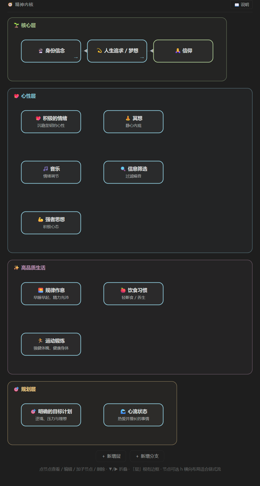<br>
  <b>🧭 精神内核</b><br>
  <sub>SVG 自动布局的价值观 / 原则树（替代手画 Canvas）。<b>多画布</b>（如「人生内核」外再建「技术成长」，切换条一键切 / 新建 / 重命名）+ 多根 + 「层」分组 + 横纵向布局；<b>节点可关联笔记</b>（从全库搜索选，不用手打路径），右下角 🔗 <b>一键跳转</b>。</sub>
</td>
</tr>
<tr>
<td width="50%" valign="top">
  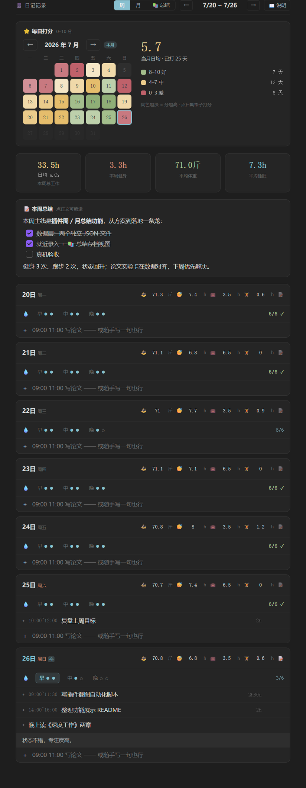<br>
  <b>📔 日记记录</b><br>
  <sub><b>⭐ 每日打分（0–10）+ 月度热力日历</b>：点日期格子打分、按月切换、三档配色（🟥差 🟨中 🟩好）<b>且同档内分数越高颜色越浓</b>（同色也能比出高低）、右栏当月日均 + 分布。<b>📝 周总结 / 月总结</b>：周 / 月视图顶部就近写回顾，「📚 总结」tab 集中翻看，正文用 <b>Obsidian 原生编辑器（Live Preview 所见即所得）</b>。另有每日体重 / 睡眠 / 工作 / 健身 4 个数字 + 💧 喝水打卡（早中晚各 2 杯）+ 时间段日志 + 周 / 月视图与汇总。</sub>
</td>
<td width="50%" valign="top">
  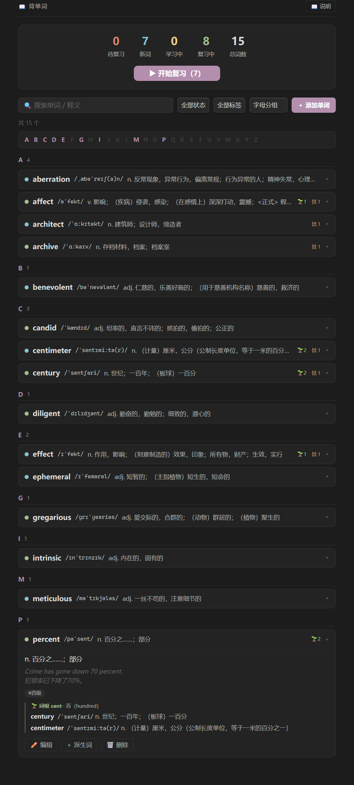<br>
  <b>📖 背单词</b><br>
  <sub>FSRS-6 间隔重复（Anki 同款调度）+ ECDICT 离线中文词库查词 + 词族关联 + 形近词自动辨析（archive/architect 这类易混词自动聚合）+ 复习弹窗。<b>词根关联</b>：给词标词根（percent/century 同属 cent「百」），同根词自动成组 + 显示词根含义（内置词根库建议、一键确认）。<b>单词列表为紧凑行 + 点击展开详情，可按首字母分组 + A-Z 索引快速查找</b>。</sub>
</td>
</tr>
<tr>
<td width="50%" valign="top">
  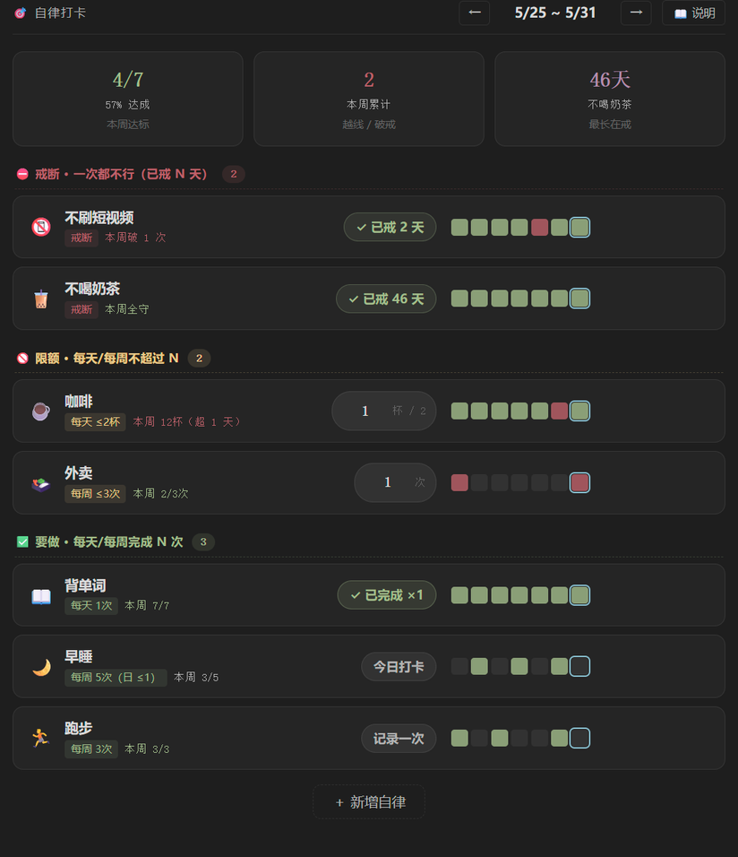<br>
  <b>🎯 自律打卡</b><br>
  <sub>要做 / 限额 / 戒断 三类约束，按类型分组 + 周视图 + 顶部三卡汇总 + 7 天迷你热力 + 自定义指标（跑步距离 / 配速 / 用时）。详情里还能<b>按月回看</b>：本月破戒 / 超标 / 活动几次、当月日历、12 个月趋势柱（点柱切月）+ 全年热力图。</sub>
</td>
<td width="50%" valign="top">
  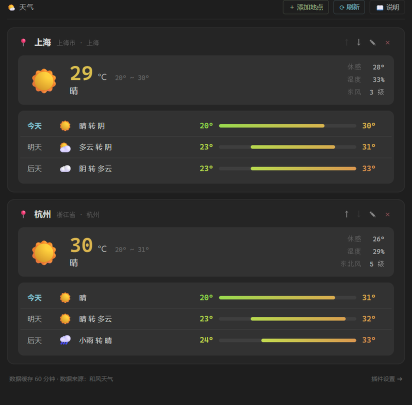<br>
  <b>⛅ 天气</b><br>
  <sub>多地点实况 + 未来 3 天预报（温度区间渐变条），数据源和风天气；支持区县搜索与镇 / 街道手动经纬度。</sub>
</td>
</tr>
<tr>
<td width="50%" valign="top">
  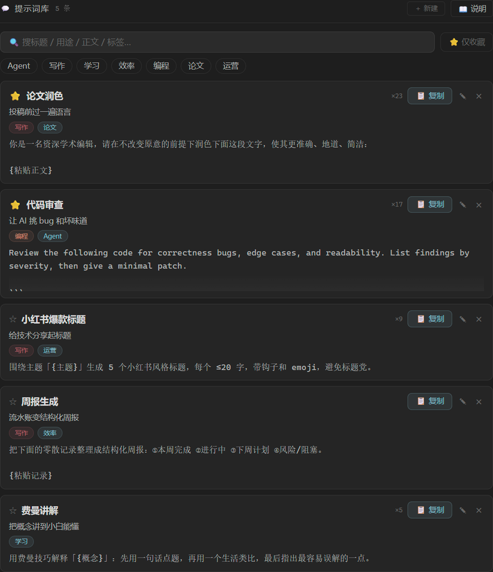<br>
  <b>💬 提示词库</b><br>
  <sub>常用 AI 提示词分标签管理：搜索 / 标签筛选 / 收藏置顶，一键复制原文直接喂给 ChatGPT / Claude / Agent。</sub>
</td>
<td width="50%" valign="top">
  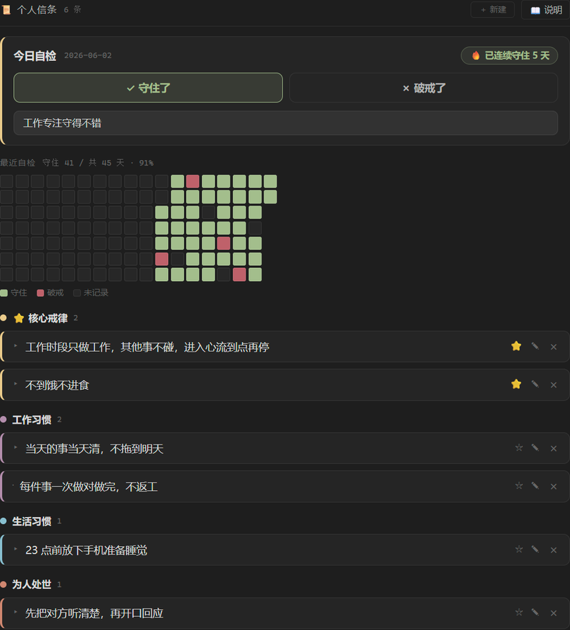<br>
  <b>📜 个人信条</b><br>
  <sub>把对自己的约束 / 原则一条条记下：分类管理 + 可展开「为什么 / 怎么做 / 触发场景」+ 核心戒律置顶；每天一次「守住 / 破戒」自检，攒连续坚持天数 + 回顾热力。</sub>
</td>
</tr>
<tr>
<td width="50%" valign="top">
  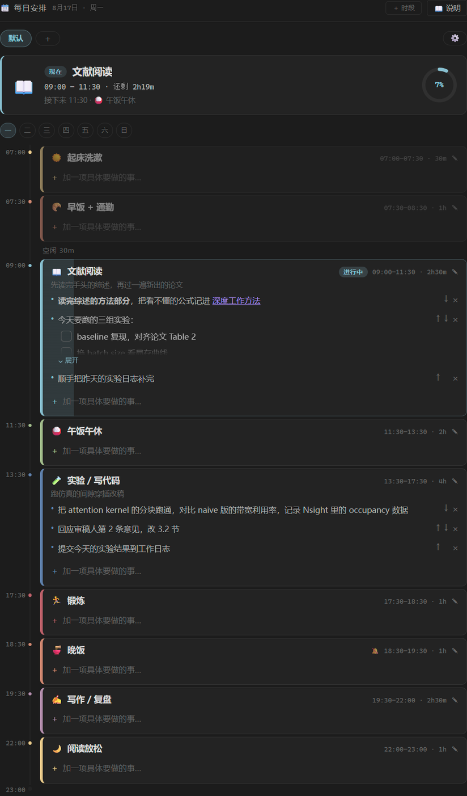<br>
  <b>📆 每日安排</b><br>
  <sub>一天的固定作息骨架：时间段排成时间轴（<b>高度随事项内容撑开</b>），当前块高亮 + 按进度填充；「现在」卡大字提醒该做什么 / 还剩多久 / 下一项预告；时段开始弹提醒。<b>可建多套作息方案（学校 / 假期一键切换）</b>，适用日再分工作日 / 周末；每个时段内可像日记那样「＋ 加一项」逐行加具体事、原地编辑 / ↑↓ 调序。<b>事项支持 Markdown</b>：加粗 / 列表 / 勾选框 / 代码，以及 <b><code>[[笔记名]]</code> 点一下跳到那篇笔记</b>（时间轴只留一句话，具体怎么做写进笔记）；点事项展开的是 Obsidian 原生编辑器（敲 <code>[[</code> 有笔记补全），超过 3 行自动折叠。</sub>
</td>
<td width="50%" valign="top">
  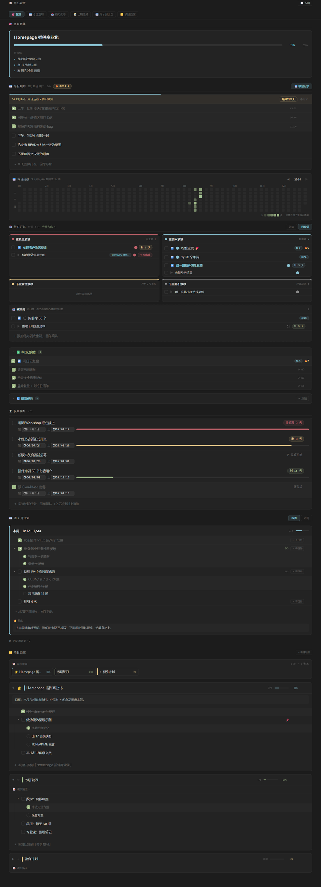<br>
  <b>🧮 待办 · 四象限</b><br>
  <sub>「今日待办」可切到艾森豪威尔四象限视图：按重要 / 紧急把待办分到 2×2 四格，未分类的待在「收集箱」；点色点或拖进格子即归类，格内按截止时间排，帮你决定先做什么。已完成项收进下方「今日已完成 / 成就记录」，格子保持清爽。</sub>
</td>
</tr>
</table>

<div align="center">
  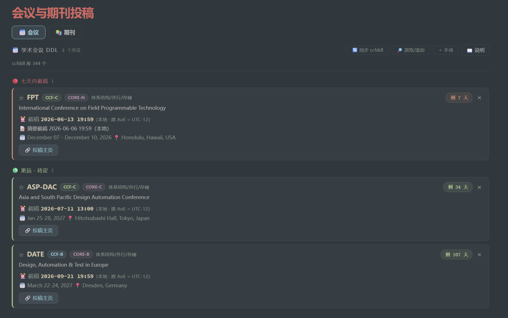<br>
  <b>📅 学术会议 / 期刊 DDL</b> · <sub>会议：ccfddl 同步 + 倒计时 + 时区换算 + 临近提醒；期刊：内置 13 个微电子 / EDA 刊的 CCF + 中科院分区 + IF + 投稿周期（🏛 官方 / 💬 网友双口径）+ 官网直达。</sub>
</div>

<div align="center">
  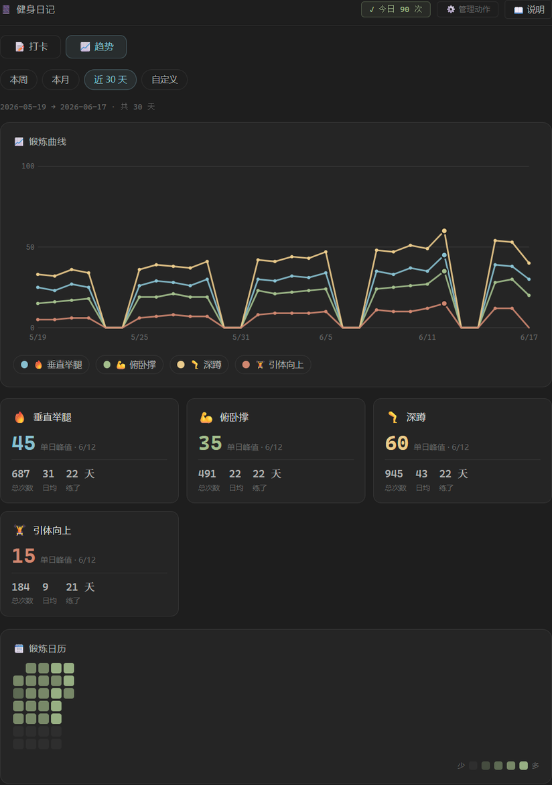<br>
  <b>📔 健身日记</b> · <sub>以「天」为中心的训练打卡：每天按<b>组记录</b>各动作（组数 × 次/组，负重动作可加 kg、选填 RPE；输入行上方有<b>列头</b>标着每格填什么，底下常显一行 RPE 是什么、怎么估）。<b>📊 累计总览</b>：从开始到今天（可按年份）的坚持天数 + 累计总次数 + 每个动作累计 + <b>全年热力图</b>（GitHub 式 52 周网格，一屏看一整年哪些天练了）。选时间段看<b>多动作锻炼曲线</b> + 每个动作的<b>单日峰值</b>及达成日 + 月历锻炼日历。</sub>
</div>

<div align="center">
  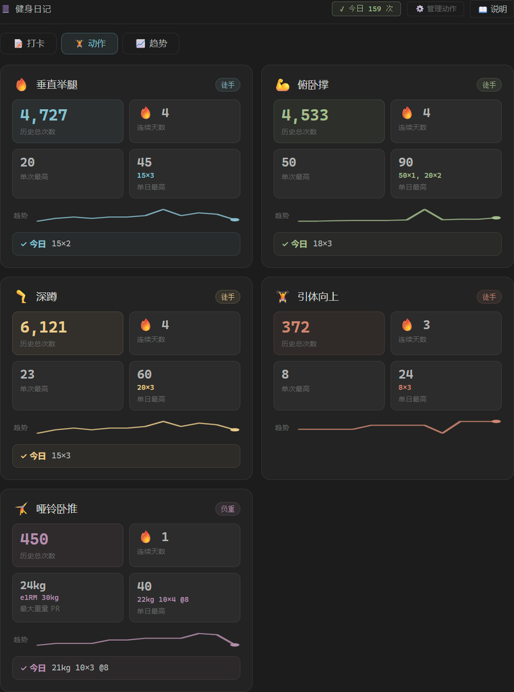<br>
  <b>🏋️ 健身日记 · 动作卡</b> · <sub>每个动作一张长期档案卡：历史总次数 / 连续天数 🔥 / <b>单次最高</b>（一组不间断做的最多次数）/ <b>单日最高</b>（含当天组构成，如 1×50 2×20 = 90）；负重动作显示<b>最大重量 PR + e1RM 力量估算</b>；「努力量」进步趋势小图 + 今日组摘要。原「健身记录」模块已并入本模块，旧数据可在「⚙ 管理动作」一键无损迁入（含重量 / RPE）。</sub>
</div>

<div align="center">
  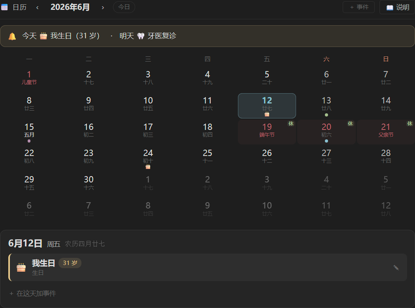<br>
  <b>📅 日历日程</b> · <sub>月历视图：一眼看全月放假 / 补班（内置法定节假日 + 调休「休 / 班」）+ 农历 + 节日（春节 / 中秋 / 母亲节 / 父亲节…）+ 家人生日（<b>支持农历，每年自动换算公历</b>）/ 纪念日 / 日程；可停右侧栏随时看，今天 / 明天的生日节日打开即提醒。</sub>
</div>

<div align="center">
  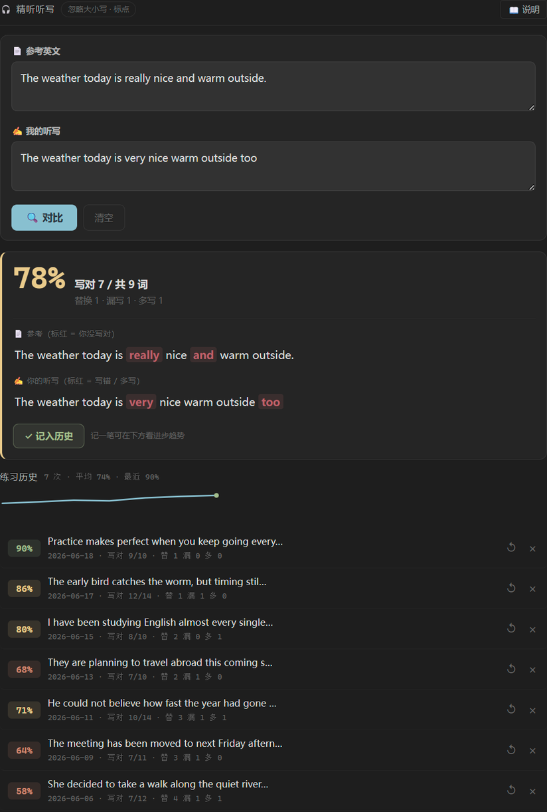<br>
  <b>🎧 精听听写</b> · <sub>英语精听练习：把你听写的句子和参考英文逐词比对，自动算出<b>单词准确率</b>，不一致的词<b>双行标红</b>方便核对（替换 / 漏写 / 多写都分得清，漏写多写不连累后面的词）。默认忽略大小写 / 标点；记入历史可看准确率进步趋势；一键「📋 复制给 AI」把原文 + 听写 + 对比结果复制下来，粘贴发给 AI 批改纠正。</sub>
</div>

<div align="center">
  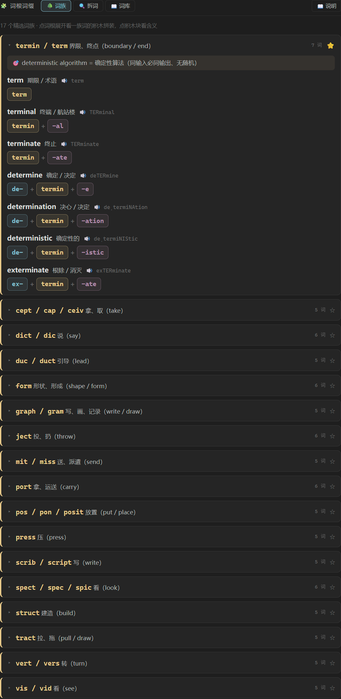<br>
  <b>🧩 词根词缀</b> · <sub>以构词单元背单词，和「背单词」互补：记住 <code>de- / termin / -ation</code> 一套拼装规则，就能拆 / 拼一整族词。<b>词族</b>视图把一族词拆成<b>彩色积木</b>（前缀蓝 / 词根金 / 后缀紫，点块看含义）+ 中文释义 + 🔊 重音迁移提示 + 锚定记忆例；<b>拆词</b>输入任意词自动拆成 前缀｜词根｜后缀；<b>词库</b>是前缀 / 词根 / 后缀三库速查（含义 / 拉丁·希腊来源 / 词例 / 后缀词性），带搜索。</sub>
</div>

<div align="center">
  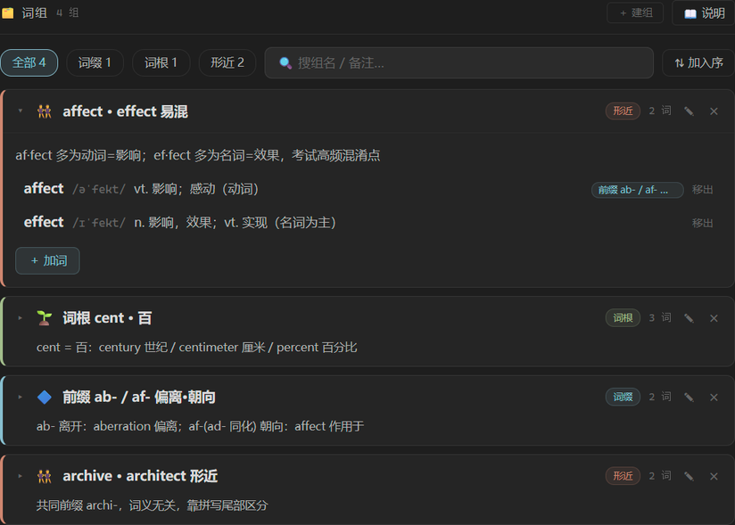<br>
  <b>🗂️ 词组</b> · <sub>以「组」为单位组织背单词——把共享同一 <b>词缀 / 词根 / 形近</b> 的词圈成一个命名的组，以组记忆；<b>一个词可同时属于多个组</b>（词↔组多对多），成员词显示「也在这些组」。组按类型分色（词缀蓝 / 词根绿 / 形近橙）+ 建组 / 类型筛选 / 搜索；组内单词可 <b>↑↓ 手动调序</b>（触屏也能用）；成员词写的<b>巧记备注</b>会在单词下方整行显示，记的助记看得到。<b>加词一个入口</b>：库里有就搜出来点选加入，<b>库里没有直接新建并自动查词</b>（音标 / 释义 / 例句自动补全）；成员词可 <b>✎ 编辑</b>，标注<b>前缀 / 词根 / 后缀</b>（建议来自「词根词缀」三库，如 reduce→re-+duc，chip 蓝 / 绿 / 紫分色）。与「背单词」<b>共享同一份词库</b>，编辑同步、词不重录。<b>重复组检测</b>：建组 / 改名时发现同名会即时提示（可直接「打开那个组」），右上「🔍 查重」还会揪出<b>名字不同但成员高度重合</b>的组，一键<b>合并</b>（词取并集并入最先建的那个、备注全保留，词库不受影响）。</sub>
</div>

<div align="center">
  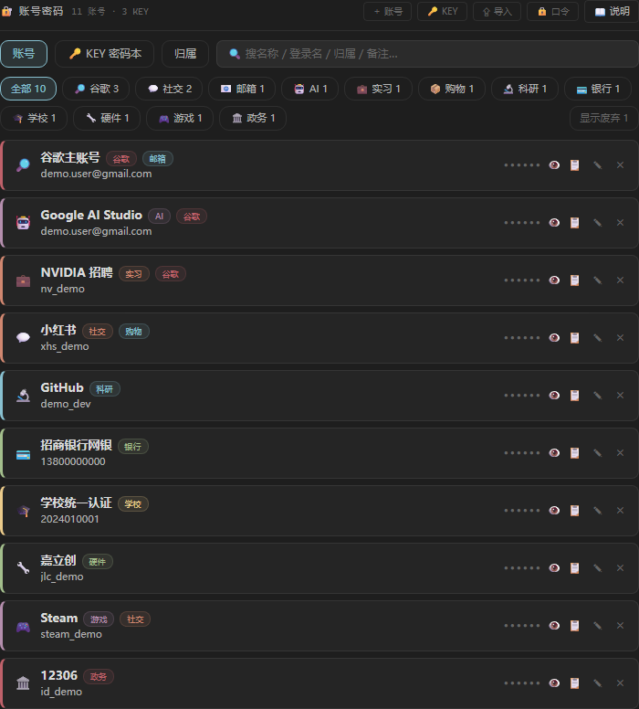<br>
  <b>🔐 账号密码</b> · <sub>把账号密码从散乱笔记里收进来，<b>能存能搜能一键复制</b>。<b>🔑 KEY 密码本</b>是核心：把反复复用的常用密码建成 KEY，账号密码可<b>「引用 KEY」</b>——改一处、所有账号同步生效，还自动反查「哪些账号在用它」。三视图：<b>账号</b>（<b>多标签</b>——一个账号可挂多个彩色标签，如「谷歌」+「邮箱」，按标签筛选）/ <b>KEY 密码本</b> / <b>归属</b>（按注册邮箱·手机号分组），顶部全局模糊搜。密码默认<b>打码</b>，👁 点开看 / 📋 一键复制。安全上走<b>「明文存储 + 访问口令轻门禁」</b>（防随手翻页 / 肩窥，口令可随时改）；支持 JSON 批量导入迁移旧记录。</sub>
</div>

<div align="center">
  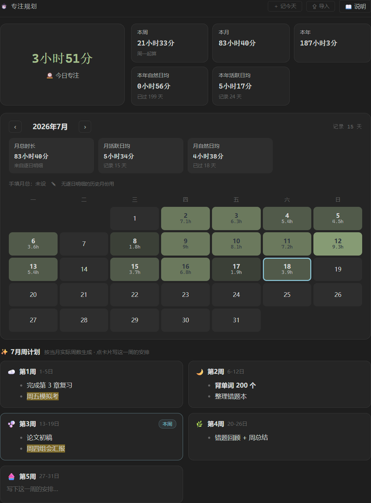<br>
  <b>⏱️ 专注规划</b> · <sub>手动记每天的专注 / 学习时长，一屏看清「今天 / 本周 / 本月 / 本年」+ 三种日均。<b>月历热力</b>：格子按当天时长四档加深（有记录 / ≥3h / ≥6h / ≥9h）、<b>格内直接显示小时数</b>、今天蓝描边，点格子弹窗填「小时 + 分钟」补记 / 修改 / 清除，任意切月（跨年也行）。统计口径讲究：<b>活跃日均只按有记录的天数真算</b>（没有明细显示「需逐日明细」，不编数字）；只知道历史月份总数？<b>手填月总兜底</b>，之后补明细自动以明细为准。下方按所选月份<b>实际周数</b>生成「✨ 周计划」卡片：点卡片写这一周的安排，编辑工具条<b>选中文字点 B / 五色淡高光圆点</b>即打标记（同色再点取消、换色直接点，不用手打语法）——高光渲染成<b>圆角小色块标签</b>、<b>加粗显示淡粉红</b>；大项下行首空格缩进小计划、显示原样保留；当前周高亮。编辑时**所见即所得**（内嵌原生 Live Preview 编辑器，直接看到加粗 / 高光效果，不满屏源码）；还支持粘贴旧版 Habit Planner Sync 插件 data.json 一键迁移（五色高光颜色保留）。</sub>
</div>

<div align="center">
  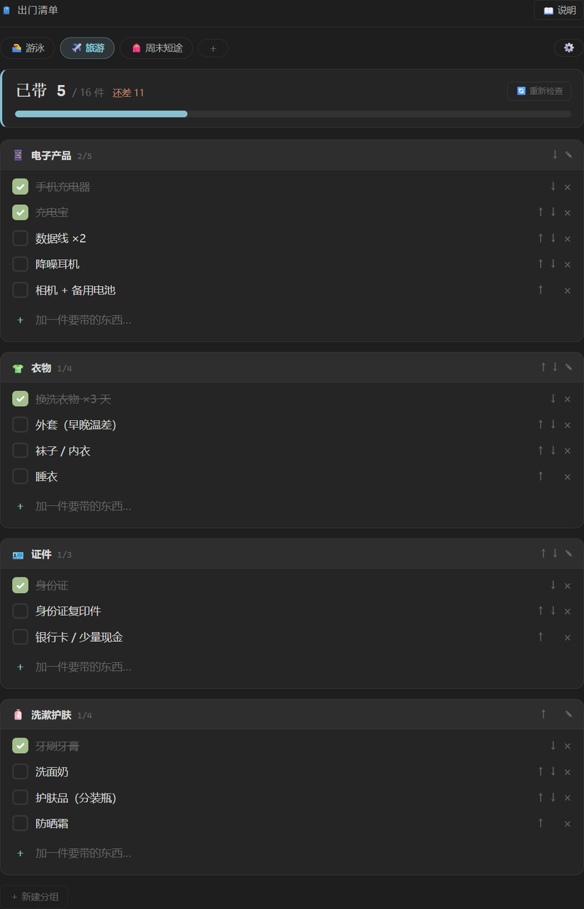<br>
  <b>🧳 出门清单</b> · <sub>出门前的打包核对——把不同出行场景（游泳 / 旅游 / 短途）各自要带的东西列成清单，出门前照着<b>一件件勾</b>，勾完整条<b>变绿「齐活，可以出发」</b>，不再靠脑子记、也不再逐条比对文档。三层结构：<b>场景 → 分组 → 物品</b>，顶部 chips 切换多套场景。<b>平铺 / 分组自动切换</b>：东西少就是干净一列，一旦建了分组（电子产品 / 衣物 / 证件…）自动变分组视图、每组带自己的进度。<b>勾选状态持久化</b>（分次收拾不丢），「🔄 重新检查」一键清空当前场景勾选，供下次出门重来。</sub>
</div>

<div align="center">
  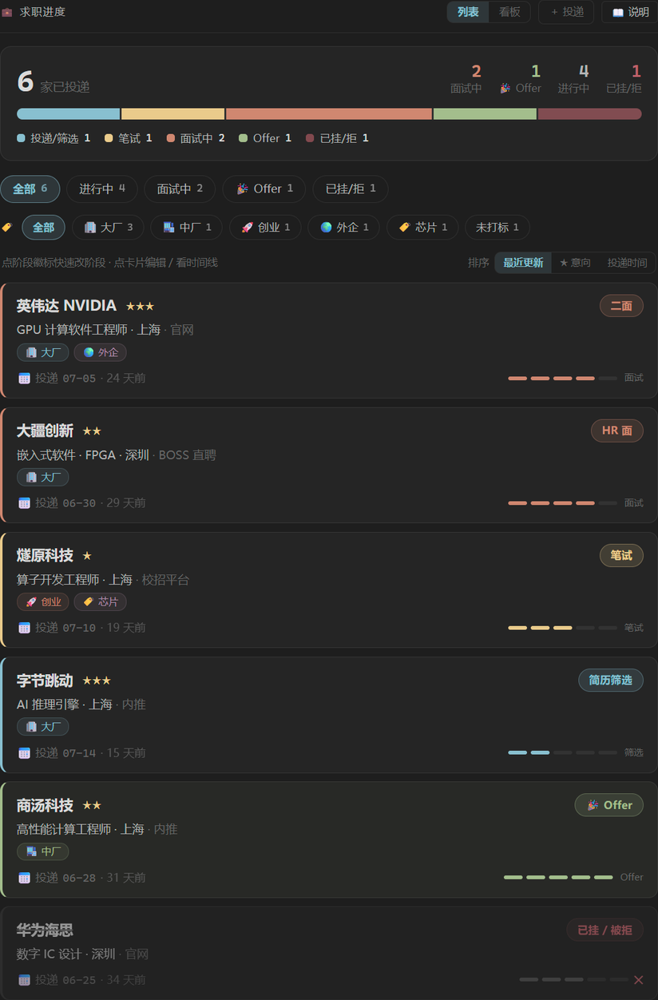<br>
  <b>💼 求职进度</b> · <sub>秋招 / 春招投很多家公司时，一目了然看——<b>投了哪些公司、什么岗位、什么时候投的、进度到哪一步</b>。以「一个岗位 = 一条记录」为单位（进度是跟着岗位走的：同一家 A 岗过了笔试、B 岗简历挂了，是两条独立进度）。<b>同一家投多个岗位会自动收成一张公司卡</b>：公司名 / 意向星 / 标签 / 共同城市只显示一次，下面每个岗位一行各带自己的阶段徽标、投递日和进度条；卡头<b>「＋ 再投」</b>给这家再加一个岗位时，公司 / 城市 / 标签 / 意向自动带上。<b>一次投递占一行</b>（岗位名 · 渠道 | 投递日 | 进度条 | 阶段徽标），窄屏自动折行。<b>两种视图</b>：<b>列表</b>（一家一张大卡，信息全，点阶段徽标弹菜单快速改阶段）/ <b>看板</b>（按 投递·筛选 / 笔试 / 面试中 / Offer / 已挂拒 <b>5 列分布</b>，卡片压缩、一屏看清进度分布），右上一键切换、记住选择。顶部<b>漏斗概览</b>：投递总数 + 面试中 / Offer / 进行中 / 已挂拒 + 分段漏斗条。阶段流水线 <b>已投递 → 简历筛选 → 笔试 → 一 / 二 / 三面·HR 面 → 🎉Offer</b> + 终态「已挂 / 被拒」「我已回绝」，Offer 卡淡绿高亮、终态卡置灰划线，每张卡带 5 段迷你进度条；每次改阶段自动记<b>时间线</b>。还能按自己的分类筛：<b>标签</b>一家可挂多个（大厂 / 中厂 / 国企 / 外企 / 远程…，预置候选之外也能自己写），🏷 一行 chips 带计数 +「未打标」桶，<b>和阶段筛选叠加取交集</b>（大厂 ∩ 面试中），选中后顶部漏斗<b>只统计这一批</b>——「大厂投了几家、面到几个、挂了几个」一眼可得；<b>意向</b> ★★★ 第一 / ★★ 第二 / ★ 备选在卡片上显金色星，可切<b>排序</b>（最近更新 / ★ 意向 / 投递时间）把最想去的顶上来。</sub>
</div>

<div align="center">
  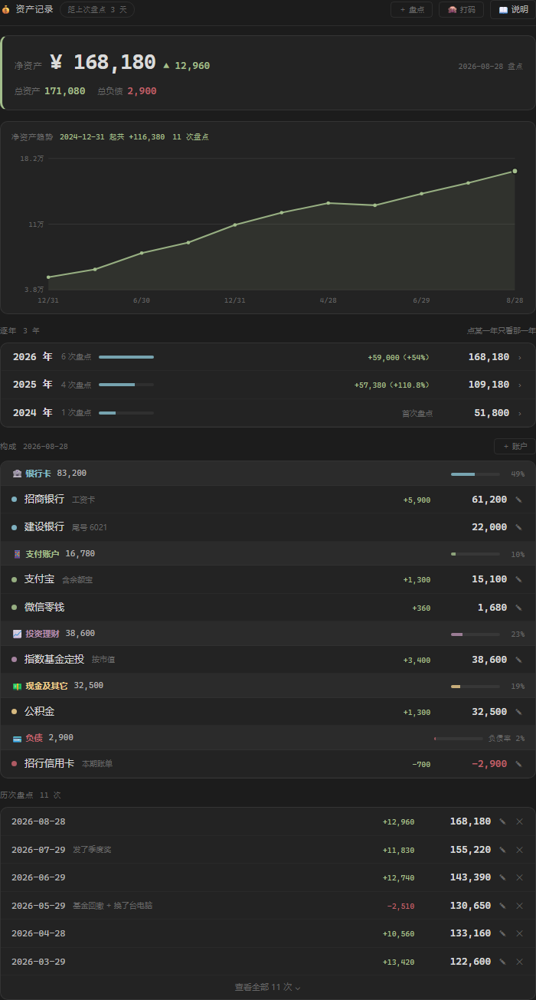<br>
  <b>💰 资产记录</b> · <sub>钱散在支付宝、好几张银行卡、理财里，还欠着信用卡，「<b>我现在总共有多少</b>」平时是算不出来的。这个模块<b>只记余额快照、不记流水</b>：每月固定一天，照着云闪付（跨行看余额）/ 支付宝「我的 → 总资产」抄一遍数字，<b>5 分钟填完</b>。（国内银行早已关闭对外数据接口，没有任何第三方能自动同步余额，所以这里选了最笨也最安全的手填——数字只留在你自己的库里。）<b>五类账户</b>：🏦 银行卡 / 📱 支付账户 / 📈 投资理财 / 💵 现金及其它 / 💳 负债；<b>负债一律填正数</b>（信用卡欠 3000 就填 3000，净资产自动减掉，不用你记负号）。<b>盘点弹窗</b>每个账户预填上次余额、只改变动的那几个，金额认 <code>12,345</code> / <code>¥12345</code> / <code>1.2万</code> / <code>50k</code>，底部实时显示本次净资产和「较上次 ±」；一天一条记录，同日重填即覆盖。主界面看四样：<b>净资产大字 + 较上次涨跌</b>、<b>净资产趋势折线</b>（涨绿跌红，鼠标悬在点上看具体某次）、<b>构成</b>（按类型分组带小计和占比条，每个账户一行显示余额与环比变化，颜色按「对你是好是坏」着色——负债减少也是绿的；负债组显示的是<b>负债率</b>）、<b>历次盘点</b>（可重填 / 删除）。<b>金额默认打码</b>成 <code>••••</code>，点 👁 才显示，概览 / 构成 / 历史 / 趋势纵轴一起遮（趋势曲线形状还在、纵轴数字藏着）。顶部<b>「距上次盘点 N 天」</b>徽章超 30 天转金色催一次——趋势得连续记才有意义。账户不用了勾「已销户 / 停用」：不再进盘点表，但历史余额照旧算数、曲线不变形。<b>逐年</b>（v1.92.0，记满两个年份才出现）：每年一行——该年盘了几次、年末净资产、<b>全年增减与涨跌幅</b>；<b>点某一年</b>，趋势曲线和历次盘点就只看那一年（概览和构成始终是最新家底，不跟着筛）。</sub>
</div>

<div align="center">
  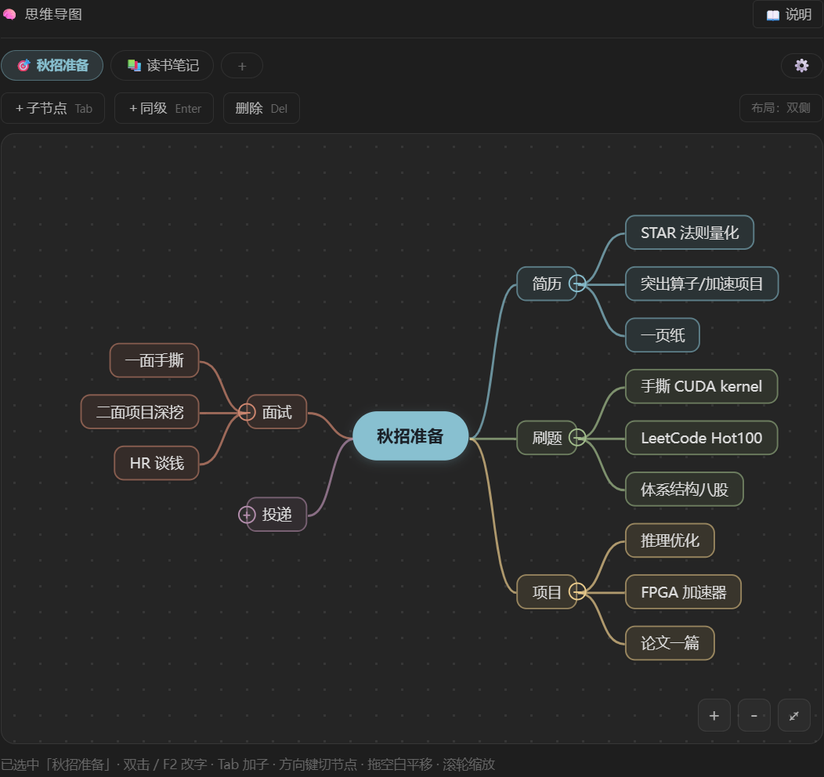<br>
  <b>🧠 思维导图</b> · <sub>在笔记里画 XMind 式<b>可编辑思维导图</b>——以中心主题往外发散、自动布局（<b>布局可选 双侧平衡 / 单侧向右 / 单侧向左</b>，顶部导图行右侧一键切），不用手动摆位置。桌面上：<b>单击选中、双击 / F2 改字、Tab 加子节点、Enter 加同级、Del 删</b>（含子树），有子节点的节点外侧 –/＋ 一点<b>折叠</b>整棵子树；拖空白<b>平移</b>、滚轮<b>缩放</b>、右下角 ＋/－/⤢ 按钮、双击空白复位到中心。每个顶层分支一种 Nord 色、子孙继承，连线随分支色。顶部可建<b>多张导图</b>切换（＋新建 / ⚙管理）。<b>手机端只读</b>：查看 / 平移 / 缩放 / 折叠，编辑在电脑上做。</sub>
</div>

<div align="center">
  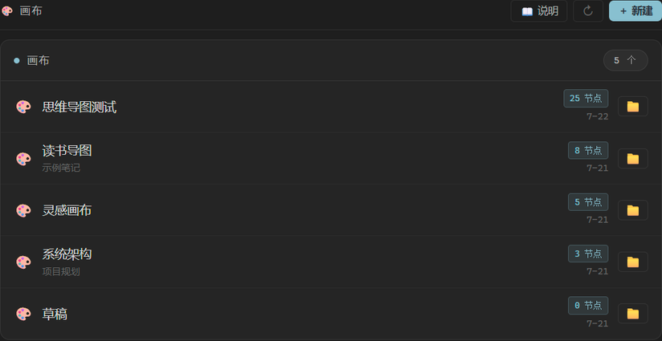<br>
  <b>🎨 画布</b> · <sub>全库 <code>.canvas</code> 画布的<b>统一入口</b>：自动扫出 vault 里所有画布，列成卡片（名称 / 所在文件夹 / 节点数 / 修改时间），<b>点击直接打开</b>、＋ 一键新建、↻ 刷新——不用再去文件树里翻；每行 <b>📁 一键在文件列表中定位</b>该画布（自动展开所在文件夹并高亮，方便就地移动 / 改名）。<b>新建的画布统一存放</b>到设置指定的文件夹（默认 <code>Data/canvas</code>，不存在自动创建）。配合下方插件级功能「🧠 画布思维导图」，就是一套原生 Canvas 思维导图工作流。</sub>
</div>

<div align="center">
  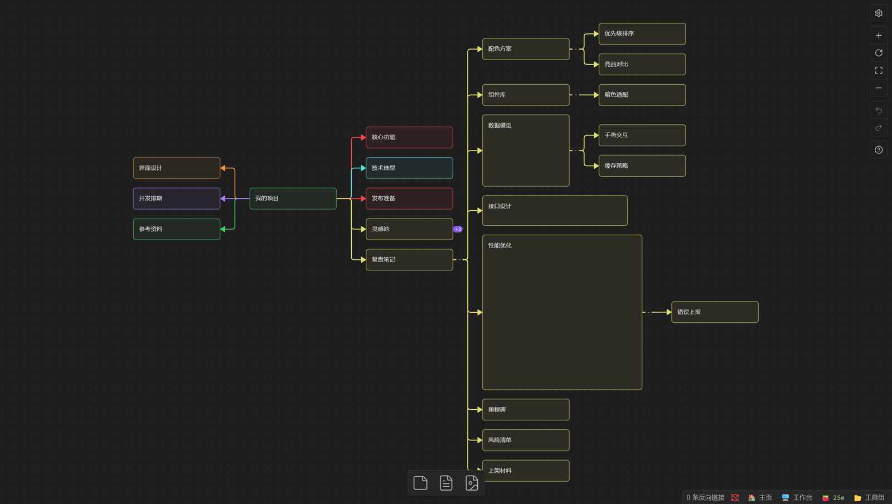<br>
  <b>🧠 画布思维导图</b>（插件级功能，桌面）· <sub>把 Obsidian <b>原生 Canvas</b> 变成键盘驱动的思维导图：<b>Tab 长子节点 / Enter 加同级</b> + 自动排版；<b>连线直角</b>（兄弟连线并成一根主干、XMind 观感，纯显示效果、文件数据不变）+ <b>节点折叠</b>（–/＋ 角标收起子树，状态随文件保存）。详见下方「插件级功能」。</sub>
</div>

---

<a id="widgets"></a>

## 🧩 主页配套小组件

<table>
<tr>
<td width="50%" valign="top">
  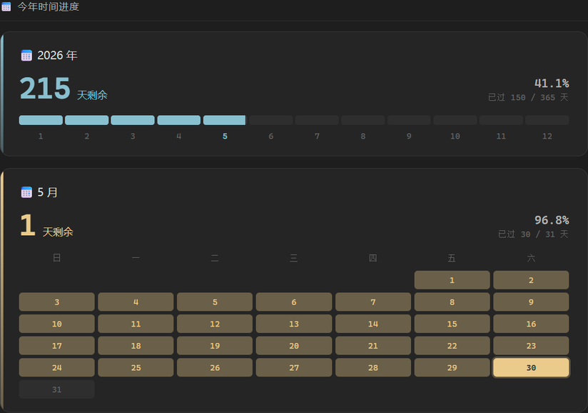<br>
  <b>📅 时间进度</b><br>
  <sub>年 / 月双卡：12 月份网格 + 日历 + 进度条 +「N 天剩余」，年蓝月金冷暖对比。</sub>
</td>
<td width="50%" valign="top">
  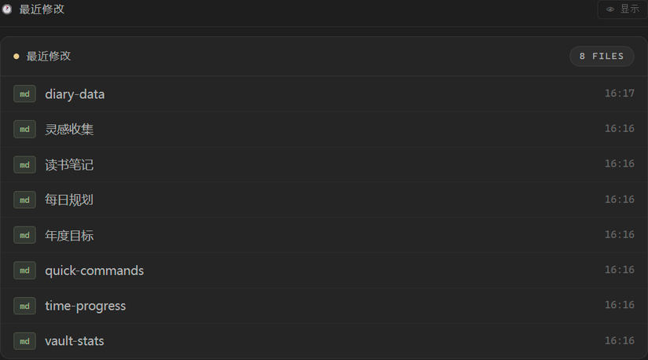<br>
  <b>📂 最近修改</b><br>
  <sub>按修改时间排前 N（默认 8）+ 扩展名 tag + 一键隐私模式（●●●●）。</sub>
</td>
</tr>
<tr>
<td width="50%" valign="top">
  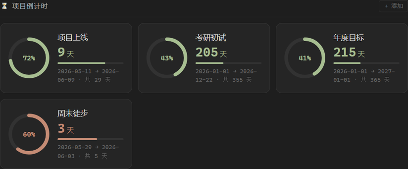<br>
  <b>⏳ 项目倒计时</b><br>
  <sub>卡片网格 + SVG 进度环 + 加 / 删 / 二次确认，<b>点卡片日期行就地改起止日期 / 名称</b>，临近变橙、到期变红。</sub>
</td>
<td width="50%" valign="top">
  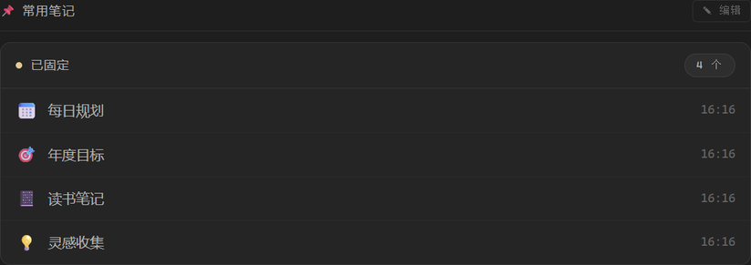<br>
  <b>📌 常用笔记</b><br>
  <sub>固定笔记列表，list / grid 双视图；添加走模糊搜索选择器，无需手打路径。</sub>
</td>
</tr>
<tr>
<td width="50%" valign="top">
  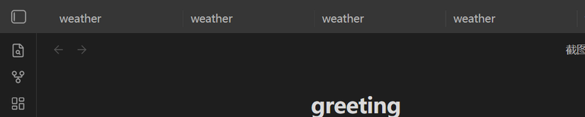<br>
  <b>👋 问候 + 名言</b><br>
  <sub>时段问候（早 / 午 / 下午 / 晚 / 夜）+ 日期 + 每日轮播名言。</sub>
</td>
<td width="50%" valign="top">
  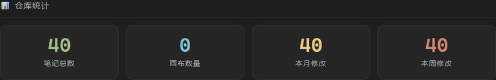<br>
  <b>📊 仓库统计</b><br>
  <sub>笔记总数 / 画布数 / 本月修改 / 本周修改，4 张大数字卡。</sub>
</td>
</tr>
</table>

<div align="center">
  <br>
  <b>⚡ 快捷命令</b> · <sub>一键执行任意 Obsidian 命令的按钮行（如笔记同步、全局搜索、命令面板）。</sub>
</div>

---

<a id="plugin-features"></a>

## 🔌 插件级功能（不写代码块，设置里开关）

### ☁️ 多设备同步设置（v1.81.0）

两台电脑（比如 Mac + Windows）同步同一个 vault 时，你会发现**插件设置没跟着过去**——工作台侧栏顺序、自己建的分组、叠加的模块，换台机器又得重新配一遍。

原因是插件设置存在 `.obsidian` 插件目录里，而 iCloud / OneDrive / git / remotely-save 这些同步方案**默认都不同步 `.obsidian`**。

打开这个功能后，可共享的设置会额外存一份到 vault 里的 `Data/plugin-settings.md`，跟着笔记一起同步：

- **随同步走**：工作台侧栏布局、自建分组、隐藏的工具、每个工具页叠加的模块；各模块数据文件位置；显示偏好与功能开关；阅读体验与 PDF 导出设置；外观主题的配色与样式预设
- **留在各设备本地**：License 授权信息、天气 API Key、账号密码模块的门禁口令（这三项是机密，写进 vault 会随同步扩散到所有设备），以及悬浮窗尺寸、侧栏折叠状态、上次打开的工具、启用换肤前的原主题（这些本来每台设备就该不一样）

**装上本版不会有任何变化**。到「设置 → 多设备同步」，在你想「以它为准」的那台设备上点一次「建立 / 覆盖」才会创建同步文件；另一台设备同步到该文件后，下次启动自动采用。之所以要手动点一下，是因为如果每台设备启动时都自动创建同一个文件，同步工具会判为冲突。

同步文件被另一台改动后会自动读回并刷新工作台，不用重启。功能可随时关闭，文件路径也可以改（两台要填成同一个路径）。

### 🖥 工作台（把整套插件当一个应用用）

不想为每个工具单独开页面？桌面端点**右下角状态栏「🖥 工作台」**（就在「🏠 主页」旁边）/ 命令「打开工作台」一键进入（移动端走左侧 ribbon）：左侧栏最上是 **🏠 主页**（打开工作台默认就显示它——一般只需开工作台、不用再单独开主页），下面分组列出全部重型工具（每日 / 学习 / 自我 / 其它），点击在主区一次显示**一个完整工具**、工具间一键跳转——像 VS Code / Notion 那样的「侧栏 + 单一主内容区」。**工具页还能叠加多个模块一起看**：页面底部「＋ 添加模块」把另一个模块（任意模块或小部件）叠到当前工具下方（如「日历日程」叠上「学术 DDL」倒计时，一屏看全安排 + 截止），叠加后**主模块与附加模块都能 `↑↓` 调序**（可把某个附加模块提到工具上方）、附加模块 `×` 移除，配置记住、重开还在。侧栏可一键折叠成图标栏腾出空间，自动记住你上次打开的工具；**侧栏工具随你增删、定制自己的工作台**——「工具」旁 ✏️ 进编辑模式：不常用的工具 **✕ 移出**、底部 **＋ 工具** 把移出的工具或小部件（问候 / 倒计时 / 最近文件…）加进侧栏，还能**拖拽调整顺序、自定义分组**（改组名 / 分组排序 / 新建删除）、一键「↺ 恢复默认」，行距紧凑到工具一屏放完、不出滚动条。工作台里 **`Alt + ↑/↓` 直接切工具**（像 IDE 切标签）；桌面端当前工具标题条右侧可「↗ 新标签打开」把它单独拉到新标签、与笔记并排看。**移动端**顶部则收成一行紧凑条（`☰ 当前工具 · ⚙️ · ↻`，点 ☰ 展开工具列表选择、选完自动收起），并去掉单独标题栏，把屏幕尽量让给工具内容。与现有「主页」仪表盘**并存**，按习惯任选。

侧栏底部还有 **「⚙️ 设置」入口**：插件所有设置直接在工作台里调，**左侧分组导航点一下只看该组**，不用一长条滚到底找；每个工具标题条的「⚙️」还能一键直达**该工具自己的设置**。Obsidian 设置里的插件设置页也是同一种用法（v1.75.3 起同样有分组导航，移动端为顶部横向分组条），两边随手用哪个都行。

<div align="center">
  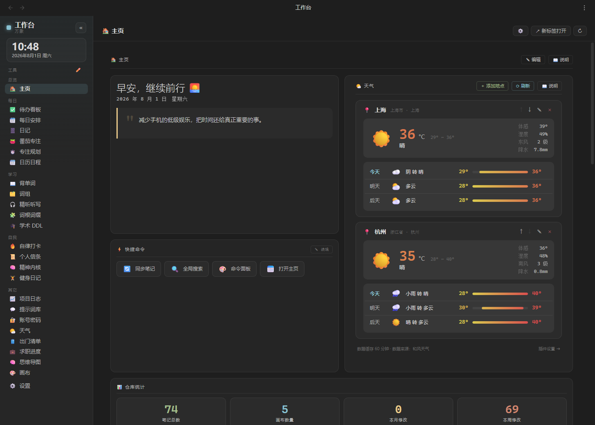<br>
  <sub><b>展开</b>：左侧分组工具导航 + 实时时钟，主区铺开完整工具（图为待办看板）</sub>
</div>

<div align="center">
  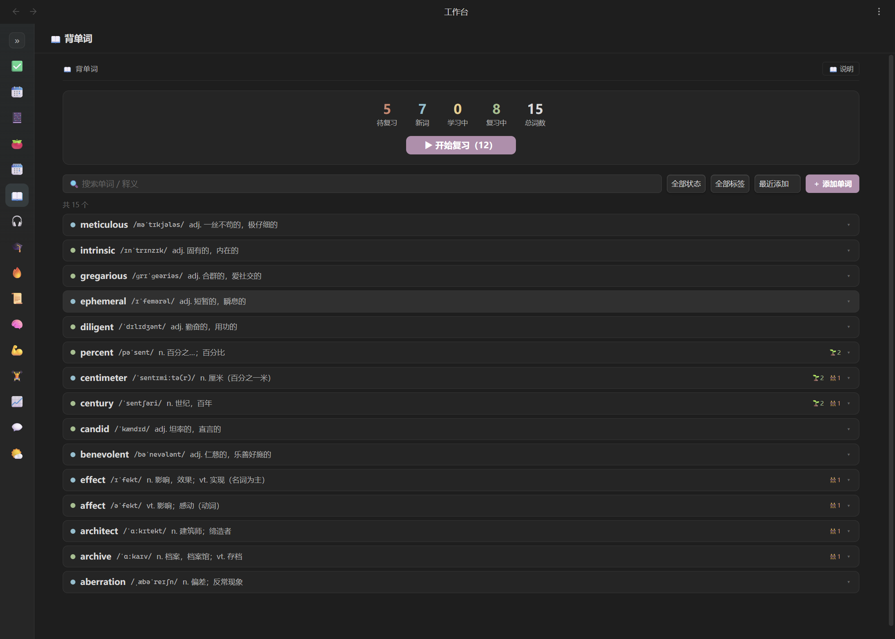<br>
  <sub><b>折叠</b>：侧栏收成图标栏（悬停显名），主区更宽（图为背单词）</sub>
</div>

<div align="center">
  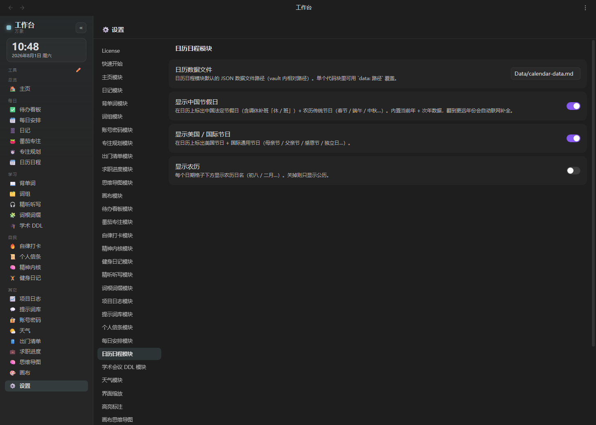<br>
  <sub><b>设置页</b>：左侧分组导航，点一下只显示该组，不用再翻 Obsidian 设置面板</sub>
</div>

- **🔄 在线更新（脱离 BRAT）** —— 插件内直接检查 / 一键更新，不用再装 BRAT。有新版时**主页 + 工作台顶部弹醒目横幅**，设置「检查更新」和命令面板也能随时主动查；点「立即更新」自动下载 + 重载生效（桌面 + 移动端通用）。**提示式、点确认才装**，不会偷偷自动换版本；作者可用 GitHub pre-release 灰度、坏版本不会推给你。更新完成后**设置页里的版本号立即变新、不再重复提示**，不用重启 Obsidian（v1.75.2 起）。 **v1.87.0 起不再受 GitHub「每小时 60 次」的访问限制**——那个限额是**按网络出口 IP 算不按人算**的，公司网关 / 机场节点 / 校园网都是几十上百人共用一个出口，配额常被别人打光、你这边就报「访问次数用完了」；现在查版本走另一条不受此限制的通道，**正常情况下检查更新一次配额都不占**，只有真发现新版才去取一次更新说明（取不到也只是没有说明文字，不会挡住更新）。安装前还会校验下载到的文件与预期版本是否一致，避免装出「版本号是新的、代码还是旧的」这种半新半旧状态。
- **🧠 画布思维导图** —— 把 Obsidian **原生 Canvas** 变成键盘驱动的思维导图，开箱即用不用绑键：选中节点按 **Tab 长子节点、Enter 加同级**（正在编辑时选中一段文字按 Tab，那段字直接变成子节点），自动连线、自动排版（节点改大小 / 内容变多也实时重排、不重叠）。**连线直角**：左右相连的连线画成规整的直角折线（兄弟连线并成一根主干，XMind 观感）——只是显示效果，`.canvas` 文件数据不变，关掉开关 / 卸载插件就回到原生曲线。**节点折叠**：有子节点的节点旁常显 –/＋ 小圆标，点一下收起 / 展开整棵子树，折叠状态保存在画布文件里、重新打开还在；子孙数据一个不动，卸载插件全部照常可见。配合「🎨 画布」模块（列出库里所有画布）就是一套 Canvas 思维导图工作流。命令面板 5 条命令可自绑键；「设置 → 画布思维导图」可关。仅桌面端（Canvas 编辑本身是桌面功能）。
- **Ctrl + 滚轮缩放整个 UI** —— 补回 Obsidian 老版本的滚轮缩放（`Ctrl + 0` 复位）。仅桌面端。
- **高亮标注：选中浮出工具条** —— 编辑模式选中文字，立刻浮出迷你工具条：**5 色背景高亮**（圆点）+ **5 色纯文字换色**（彩色 A，只改字色不带背景）+ **5 色整段高亮**（方块，把整段包成彩色 callout 色块）+ 🧹 一键清除（连你以前手写的 `<font color>` 也能清）。颜色直接写进笔记（行内样式 / Obsidian 原生 callout），**以后就算卸载插件，高亮也不掉色**。对已上色的文字点新颜色即换色；每个颜色都有命令可绑快捷键。仅桌面端。
- **番茄状态栏指示器** —— 底部状态栏一眼可见番茄进度（倒计时显示剩余、沉浸模式显示已专注时长），点击 = 开始 / 暂停 / 继续。仅桌面端。
- **阅读体验：图片对齐 + 页面行宽 + 去嵌入竖条** —— 可选图片对齐（左 / 中 / 右）+ 自定义行宽 + 去掉 `![[...]]` 嵌入笔记的左侧竖条（阅读视图 + 导出 PDF 同时生效）。默认零影响。
- **一键打开文档组** —— 右下角状态栏「📂 工具组」按钮点一下打开你预设的一组常用文档（各成标签页），快速恢复阅读布局；已打开的不重复开。设置里用文件选择器配置 + 排序。仅桌面端。
- **PDF 导出增强** —— 导出 PDF 时让**表格不跨页**（纵向：整张尽量落一页，放不下的大表保证「行不腰斩 + 表头每页重复」）+ **宽表适应页宽**（横向：太宽的表不裁右侧列、单元格内容自动换行，可再选字体缩放），可选 callout / 代码块 / 图片也不跨页；命令「插入 PDF 目录页」给当前笔记插入一段**「隐身目录」**——平时在编辑/阅读视图隐藏、不碍眼，**导出 PDF 时自动显示**成一页目录（供读者看全文章节结构，`[[#标题]]` + 层级缩进），一次插入、以后每次导出都自动带，「移除 PDF 目录页」彻底撤掉。设置里配目录标题 / 收录层级 / 是否单独成页。注：受 Obsidian 原生导出限制，PDF 里目录项不可点击跳转、也不生成 PDF 书签（Obsidian 老限制）。
- **外观主题：全局换肤** —— 「设置 → 外观主题」一键开启，用内置的一套自定义外观给整个 Obsidian 换肤、关闭切回原主题。冷色沉静风（呼应插件的 NORD 配色），保留描边卡片质感，并关掉了重度毛玻璃换纯色卡片——**更清爽、滚动顺滑**。内置 **10 套大牌配色**（Catppuccin / Tokyo Night / Rosé Pine / Everforest / Nord / Gruvbox / Dracula / Solarized / Kanagawa / One Dark，全部官方色值、多数暗色 + 亮色都有），点色块即时整套换肤，还能直接切 ☀️ 亮 / 🌙 暗。另有 **4 套样式预设**（标准 / 圆润立体 / 锐利紧凑 / 极简沉浸），和配色自由组合。文件树里**文件夹与文档一眼区分**（文件夹名亮色加粗 + 彩色文件夹图标）。走 Obsidian 原生主题机制，不和你当前主题冲突。基于开源主题 Border（© 2022 Akifyss · MIT）定制。

<p align="center">
  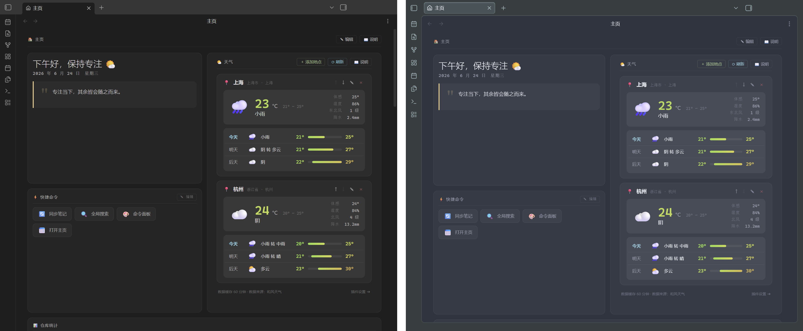<br>
  <sub>「外观主题」前后对比　·　左：Obsidian 默认　→　右：开启外观主题（基于 Border 定制，已关毛玻璃优化）</sub>
</p>

<p align="center">
  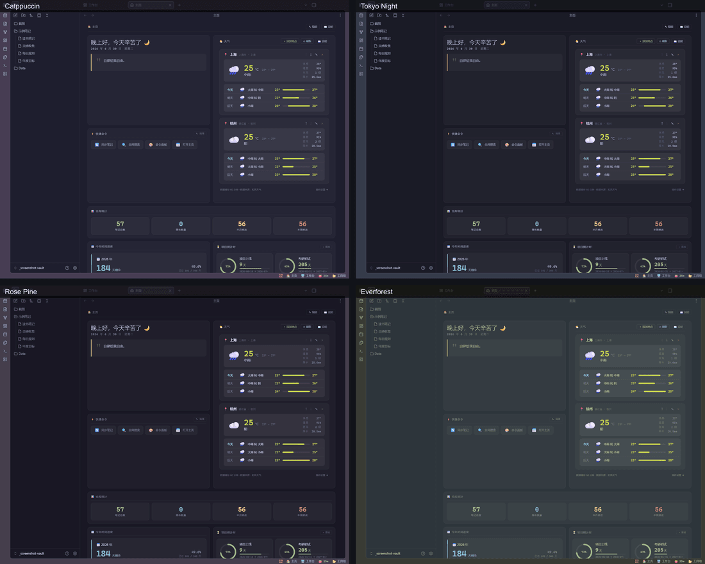<br>
  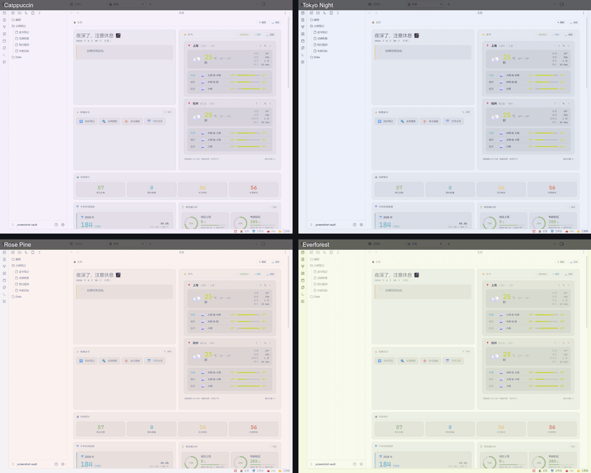<br>
  <sub><b>10 套大牌配色任选</b>（Catppuccin · Tokyo Night · Rosé Pine · Everforest · Nord · Gruvbox · Dracula · Solarized · Kanagawa · One Dark，图示其中几套）· 暗色 + 亮色都有 · 「设置 → 外观主题」点色块即时整套换肤</sub>
</p>

<p align="center">
  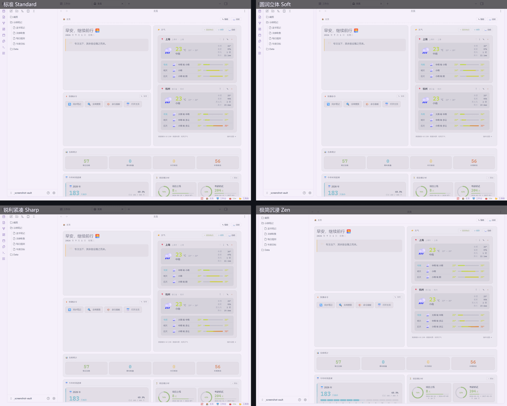<br>
  <sub><b>4 套样式预设</b>（标准 / 圆润立体 / 锐利紧凑 / 极简沉浸）· 和配色正交、自由组合 · 极简沉浸自动隐藏 tab 栏 / 状态栏 / 侧栏 ribbon</sub>
</p>

---

<a id="pricing"></a>

## 💰 付费说明（v1.0.0 起商业化）

**Payment Required — 3 天免费试用 + 一次买断终身使用**

| 项目 | 内容 |
|---|---|
| 💸 价格 | **¥39 一次买断**（不是订阅，永久有效，跨所有未来版本） |
| ⏳ 试用 | 装上后自动进入 **3 天免费试用**，全部功能解锁（首次启动联网注册一次试用，之后离线照常用） |
| 🔑 激活方式 | 收到 License Key 后，在「设置 → 万象 → License」粘贴 Key 即可激活 |
| 💻 设备数 | 一个 Key **最多绑定 3 台设备**。换电脑前在旧设备点「解绑本设备」即可腾出名额 |
| 🌐 联网要求 | **试用首次启动 + 激活时各联网校验一次**（只传匿名设备标识 / Key，**不传任何笔记内容**）；之后**离线运行**，断网也有 3 天宽限 |
| 🔄 版本更新 | License 跨版本永久有效，未来插件更新无需重新付费 |

### 购买方式

**小红书联系作者**（搜「雪天鱼」/ 小红书号 `6289484655`）：


扫码或在小红书搜索「雪天鱼」私信，备注「homepage-modules license + 你的邮箱」。
作者收款后 24h 内将 License Key 发邮件给你。

---

<a id="privacy"></a>

## 🛡 隐私政策

本插件遵循 Obsidian「offline-first」原则，业务数据全程留在本地：

- ✅ **不上传任何笔记内容**：日记 / 待办 / 番茄 / 词汇等所有业务数据始终停留在你的 vault 内，绝不外传
- ✅ **不收集使用统计、不监控行为**
- ✅ **试用首次启动 + 激活时联网一次**：仅向授权服务器上传一个**匿名设备标识**（随机串，存本地、不随 vault 同步、不含任何个人信息）+ 激活时的 License Key，用于注册试用首次时间 / 校验授权和设备数上限（最多 3 台）；之后离线运行，**不再连接服务器**（断网另有 3 天宽限自动重试）
- ✅ **未激活时数据安全**：试用结束 / 未激活时插件不修改你 vault 里的任何 `Data/*.md` 文件，激活后所有数据原样回来

另一处可选网络请求是 **天气模块**调用和风天气 API 查询你配置的城市，这是模块功能必需，跟 License 验证无关。

---

<a id="install"></a>

## 📦 安装

两种方式任选其一，**推荐 BRAT（能跟随发布自动更新）**；不想装 BRAT、或 BRAT 撞 GitHub 限额、内网离线时，用「方式二 手动本地安装」。

### 方式一：BRAT（推荐，自动更新）

本插件未上架社区市场，用 [BRAT](https://github.com/TfTHacker/obsidian42-brat) 安装与自动更新：

1. 安装并启用社区插件 **BRAT**
2. BRAT 设置 → **Add Beta Plugin** → 填入本仓库：
   ```
   XueTianyu24/obsidian-homepage-modules
   ```
3. 启用 **万象**

之后每次发布新版本，BRAT 会在所有设备上自动更新。

### 方式二：手动本地安装（无需 BRAT，适合离线 / 限额）

1. 打开本仓库的 [**Releases**](https://github.com/XueTianyu24/obsidian-homepage-modules/releases/latest)，下载最新版附带的三个文件：`main.js`、`manifest.json`、`styles.css`
2. 在你的 vault 里进入（没有就新建）插件目录：
   ```
   <你的库>/.obsidian/plugins/homepage-modules/
   ```
3. 把上面三个文件放进该目录
4. 回到 Obsidian → **设置 → 第三方插件**，点刷新，启用 **万象**（若列表里没看到，完全退出再重开 Obsidian）

> ⚠️ 手动安装**不会自动更新** —— 每次发布新版都要回 Releases 重新下载这三个文件覆盖旧的。想要自动更新请用上面的 BRAT 方式。
>
> 💡 `.obsidian` 是隐藏目录（需在系统里开启「显示隐藏文件」）；插件目录名**必须**是 `homepage-modules`，否则 Obsidian 不识别。

#### 🔑 BRAT 提示 GitHub API rate limit 怎么办

BRAT 检查更新要调 GitHub 接口，**不登录时匿名限额只有 60 次/小时**（按 IP 算）。

> ℹ️ 这说的是 **BRAT 自己**的检查更新。**本插件内置的「🔄 在线更新」自 v1.87.0 起已不走那个限额**（正常检查一次配额都不占），所以只用本插件自更新的话不需要配 token；下面这套是给「BRAT 管着一堆 beta 插件」的情况用的。
装的 beta 插件一多、或频繁点检查更新，就容易撞到 `GitHub API rate limit` 报错。配一个 GitHub **Personal Access Token（PAT）** 认证后，限额升到 **5000 次/小时**，基本一劳永逸：

1. 打开 GitHub → 右上头像 → **Settings → Developer settings → Personal access tokens**，生成一个 token（**Tokens (classic)** 或 **Fine-grained tokens** 都行）
2. **装公开插件无需任何权限**：classic token **不用勾选任何 scope**；fine-grained 选 **Public Repositories（read-only）** 即可。token 只用于认证身份、提高限额，不需要写权限
3. 建议设个**过期时间**（别选 No Expiration）；生成后**立刻复制**（离开页面就不再显示）
4. 回到 Obsidian → **设置 → BRAT → 填进「Personal Access Token」字段**，填完会自动校验有效性

> 💡 生成 token 时 GitHub 可能要求用 **密码 / 两步验证 / Passkey（通行密钥——指纹、面容或设备 PIN）** 再确认一次身份，这是它的安全步骤，按提示验证即可（不想用 Passkey 可点验证框里的「用其他方式验证」切回密码）。
>
> ⚠️ token 等同密码：**存进密码管理器、不要外泄、不要提交进任何仓库**。过期后限额会掉回 60，重新生成换上即可。

<a id="quick-start"></a>

## ✨ 快速开始（推荐）

装好后，命令面板（Ctrl / Cmd + P）搜「**创建效率工具页面**」，或在 **设置 → 万象 → 快速开始** 点「创建页面」：插件会在你 vault 的「效率工具」目录下，为日记 / 番茄 / 待办 / 背单词 / 词组 / 自律 / 精神内核 / 天气 / 健身 / 健身日记 / 精听听写 / 词根词缀 / 项目日志 / 提示词库 / 个人信条 / 学术 DDL / 每日安排 / 日历 / 账号密码 / 专注规划各建一个**开箱即用**的页面 + 一张总览导航页。

- **可选、不自动执行**：只有你主动点才会创建，绝不擅自动你的 vault
- **不覆盖**：已存在的同名文件自动跳过
- 目录名可在设置里改。主页（仪表盘）继续放轻量小部件，这些重型工具走各自独立页面更好用

<a id="usage"></a>

## 🚀 使用

在任意笔记里写一个代码块，语言写 `homepage`，第一行写模块 id：

````markdown
```homepage
diary
```
````

把多个模块拼成一张主页：桌面端点底部状态栏「🏠 主页」/ 移动端点左侧 ribbon /
命令「打开主页」，即可打开独立的主页标签页，铺满面板。首次打开可一键应用推荐布局；
编辑模式下 ↑↓ 调位置 / ▢▭ 切单列整行 / ⇕ 切跨行高度 / + 添加模块 / 切 1·2·3 列。

每个模块头部都有「📖 说明」按钮，点开即是该模块的完整用法。

### 模块 id 一览

| 模块 id | 名称 | 模块 id | 名称 |
|---|---|---|---|
| `home` | 主页（聚合） | `diary` | 日记记录 |
| `vocab` | 背单词 | `todo` | 待办看板 |
| `pomodoro` | 番茄专注 | `discipline` | 自律打卡 |
| `psyche` | 精神内核 | `weather` | 天气 |
| `project-log` | 项目日志 | `vault-accounts` | 账号密码 |
| `greeting` | 问候 + 名言 | `vault-stats` | 仓库统计 |
| `time-progress` | 时间进度 | `countdown` | 项目倒计时 |
| `pinned-notes` | 常用笔记 | `recent-files` | 最近修改 |
| `quick-commands` | 快捷命令 | `prompts` | 提示词库 |
| `principles` | 个人信条 | `deadlines` | 学术会议 / 期刊 DDL |
| `schedule` | 每日安排 | `calendar` | 日历日程 |
| `workout` | 健身日记 | `dictation` | 精听听写 |
| `morph` | 词根词缀 | `vocab-groups` | 词组 |
| `focus-planner` | 专注规划 | `packing` | 出门清单 |
| `jobs` | 求职进度 | `assets` | 资产记录 |
| `mindmap` | 思维导图 | `canvases` | 画布 |

---

<a id="sync"></a>

## 🔒 多设备同步保护

数据存 vault 内 `.md` 文件，可见、可 git、卸载后仍在。多设备同步（remotely-save 等）
场景下接入了「新设备保护门」：数据文件不存在且本会话未确认时，模块不渲染可编辑界面，
显示保护提示 + 「重新检查 / 全新开始」，避免新设备造冲突文件覆盖真实数据。

<a id="platform"></a>

## 📱 平台

桌面端与移动端（iOS / Android）均可用。悬浮窗 / 状态栏 / 滚轮缩放等桌面专属功能
在移动端自动跳过、不影响其它模块加载。

---

作者：雪天鱼 · MIT License

> 注：文档中的截图为演示数据，安装后所有数据均来自你自己的 vault。
